# Tehtävä h1

Tehtävät ovat Tero Karvisen opintojaksolta [Linux Palvelimet 2025 alkukevät](https://terokarvinen.com/linux-palvelimet/).

---

x) Lue ja tiivistä...

- Hyvän raportti on toteutettu niin, että: 
  - sen toimenpiteet ovat toistettavia ja täsmällisiä
  - se on helppolukuinen
  - lähdeviittaukset ovat kunnossa.


- "Free software" tarkoittaa sitä, että sen käyttäjä on vapaa ajamaan, kopioimaan, jakelemaan, opiskelemaan, muuttamaan ja kehittämään ohjelmistoa.
- "Free software" määritelmä tulee siitä, että se täyttää edellä olleet kohdat.
- "Open source" ei ole sama asia kuin "Free software".
- "Free software" voi olla kaupallista.
- Yksinkertaisin tapa tehdä ohjelmistosta vapaa on laittaa se public domainiksi.

a) Asenna Linux virtuaalikoneeseen. (Tee raporttia varten uusi virtuaalikone, vaikka olisit asentanut sen aiemmin).

Käytin Parallels Desktop nimistä ohjelmaa, jolla voi asentaa ja hallinnoida virtuaalikoneita ARM macOS:ssa. 


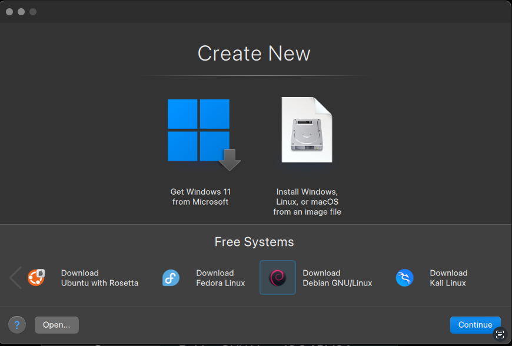


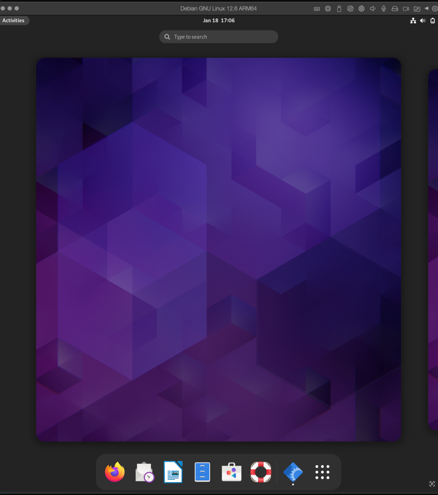

Boring! Koska tämä ei kehittänyt minua Linuxin asentamisessa mitenkään ajattelin asentaa Linuxin toiselle koneelle suoraan raudalle. Sitten voisin opintojaksolla käyttää jompaa kumpaa ja varsinkin jos tulee sellainen tilanne, johon ei ARM-ympäristö sovikkaan. Jännä nähdä tuleeko sellaista tilanneta ja että pystyykä silloin käyttämään tuota Parallelsin Ubuntu with Rosetta -virtuaalikonetta.   


## Arch Linux asentaminen MacBook Air 2018 (T2 security chip)

Asennus tulee perustumaan https://t2linux.org/#Installation ohjeisiin. Ohjeena käytettiin myös muita lähteitä, joista mainitaan käytettäessä erikseen. Käytin paljon videota: https://www.youtube.com/watch?v=x0Qmaa38UM8, niin mainitsen sen jo tässä alussa.

## Ympärisö


## Alku toimenpiteet

---

### Linux ISO:n laittaminen USB-tikulla

1. Asenna balenaEtcher
2. Lataa ISO https://github.com/t2linux/archiso-t2/releases/tag/2024.07.13
3. Flash ISO USB-tikulle balenaEtcherillä

Kaikki toimi ohjeiden mukaan.

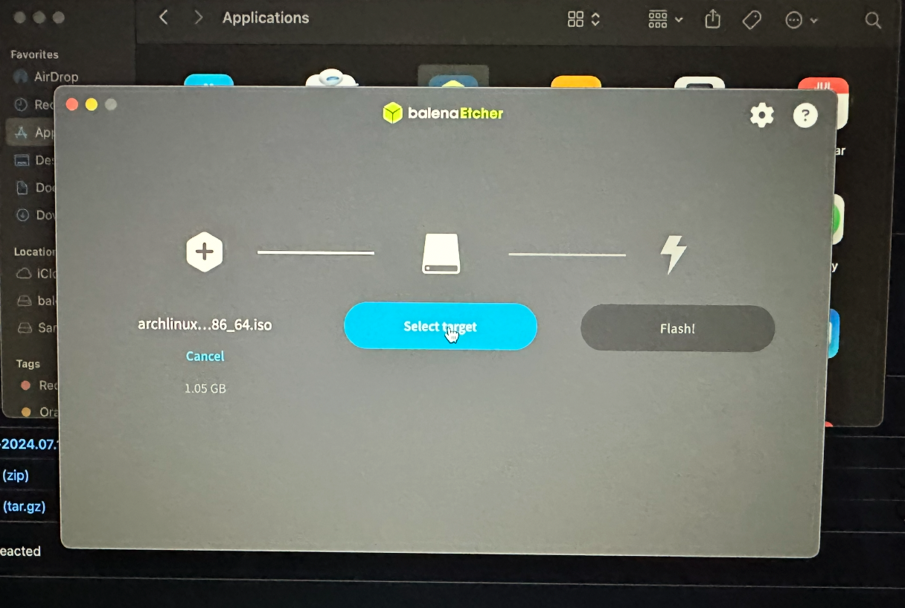

### Levyn partiointi

In macOS Disk Utility you need to create your Linux partition:

1. Open Disk Utility
2. Choose the volume you want to partition for Linux
3. Press in the top-right "Partition"
4. Under the blue pie chart press "+" button
5. When prompted be sure to select "Add Partition" and NOT "Volume", you want a partition.
6. Name: choose a name for the partition, e.g. Linux
7. Format: choose whatever format there is - APFS or another - it doesn't really matter (during the Linux installation you must erase your created partition anyway)
8. Size: pick the desired amount of space for Linux, because you will not be able to change it.

Kaikki toimi oletusti ja ohjeiden mukaan myös tässä


### Secure Boot laittaminen pois päältä

1. Turn off your Mac
2. Turn it on and press and hold Command-R until the black screen flashes
3. Your Mac will boot in the macOS Recovery
4. Select your user and enter your password
5. Now, from the menu bar choose Utilities > Startup Security Utility
6. Enter again the password
7. Once in Startup Security Utility:
8. set Secure Boot to No Security
9. set Allow Boot Media to Allow booting from external or removable media

Myös tämä meni suoraan ohjeiden mukaan.

### Linux asennuksen boottaamine USB-tikulta

1. Ensure the Linux Installation USB you created is plugged into your Mac.
2. Reboot while holding down the option (⌥) key, this will put you in macOS Startup Manager.
3 Select the orange EFI option with arrow keys and press return/enter on it. If there are two, try the one to the very right first (the last one).

Valitsin ohjeiden mukaan kaikkein oikeamman puoleisen.


 

## Follow distro specific steps

---

Täm osio perustuu t2linux.org lisäksi https://wiki.archlinux.org/title/Installation_guide

Tässä vaiheessa asennus näytti tältä:

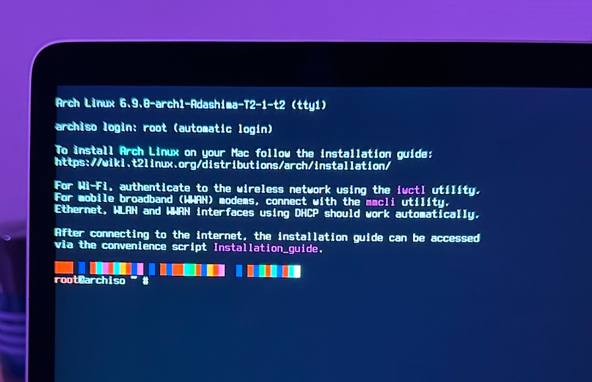


### Näppäimistön kieli

Näppäimistän kielenä oli US ja erikoismerkkien kirjoittaminen vaikee joten kieli piti vaihtaa.

Listan kielistä sai komennolla:
```
# localectl list-keymaps
```
Kielen vaihtaminen suomeksi onnistui komennolla:
```
# loadkeys fi
```

### Fontti

Pysyin default fontissa

### Verify the boot mode

```
# cat /sys/firmware/efi/fw_platform_size
```
Palautti 64 eli ok.


### Internettiin yhdistäminen

Käytin komentoa:

```
# iwctl
```

Tämä avasi interaktiivisen promptin, johon syötin seuraavat komennot

First, if you do not know your wireless device name, list all Wi-Fi devices:
```
[iwd]# device list
```
Then, to initiate a scan for networks (note that this command will not output anything):
```
[iwd]# station name scan
```
name tilalle tuli laitteen nimi

Tämän jälkeen syötin seuraavat komennot:
```
[iwd]# station name get-networks
[iwd]# station name connect SSID
```
get-networks antoi listan verkoista ja kirjoitin oman verkkoni nimen seuraavaan komentoon SSID tilalle.

Seuraavaksi kokeilin 
```
# ping archlinux.org
```
ja internetyhteys toimi.

### Update the system clock

```
# timedatectl
```

Time zone oli UTC, +0000 ja kellon aika oli siihen nähden oikein. 
Olettaisin, että time zonea ei kuulu asennuksen aikana muuttaa, koska siitä ei ole oppaassa mainintaa joten jätin sen +0000

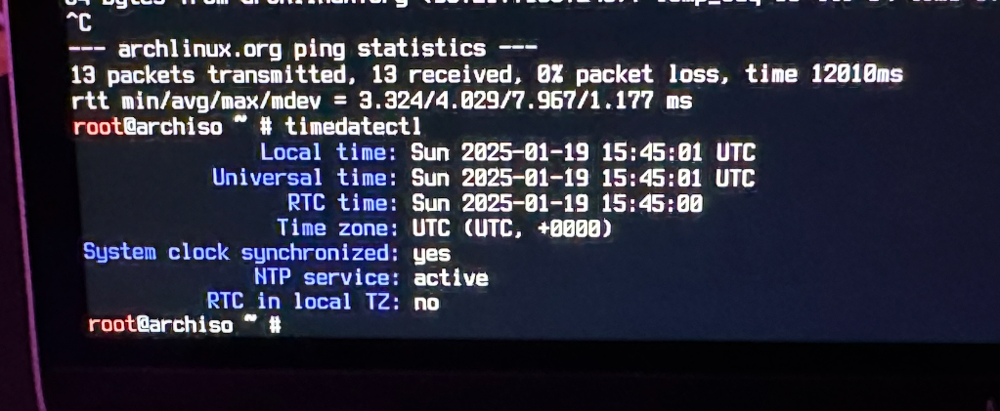

(kuvassa näkyy myös archlinux.org pingin onnistuminen)

### Partition the disks

Skipataan ohjeiden mukaan, koska tehtiin jo aikaisemmin macOS:n kautta.

### Format the partitions

Tässä vaiheessa aloin käyttää apuna ensimmäisessä kappaleessa mainitsemaani videota "Dual Boot Arch Linux and macOS" (jatkossa DBARCH-video) ja oli hieman hämilläni mitä minun pitäisi tehdä, koska wiki.archlinux.org ohjeet ohjeistivat tekemään formatoinnnin myös swap_partitionille ja minulla ei ollut sellaista. Lisäksi en oikein tiennyt, että mitkä partitiot minun pitäisi formatoida. Katsoin DBARCH-videota eteenpäin ja siinä selitettiin hieman tarkemmin, eikä myöskään tehty swapille omaa partitiointia. Jostais syystä videolla kyllä tehtiin disk partitiointi, jonka jätin tekemättä, koska se oli ristiriidassa t2linux wikin kanssa. Asennus eteni seuraavien kuvien mukaisesti:

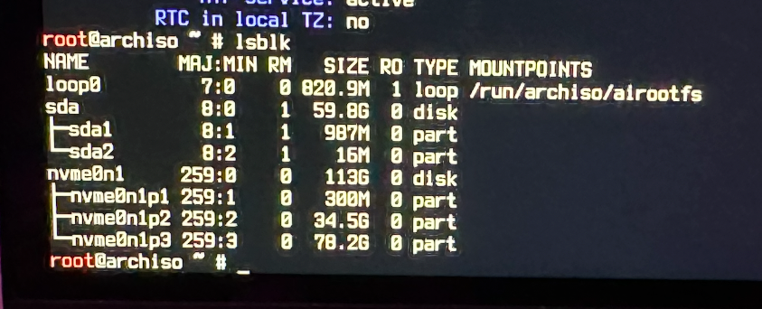

Seuraavasta kuvasta ja DBARCH-viedon selvennyksestä ja t2linux ohjeesta ymmärsin, että minun tulee formatoida /dev/nvme0n1p3. /dev/nvme0n1p1 olisi sellaisenaan ok.


t2linux wikin ohje


Formatointi


mount ja /mnt/boot direkstoryn tekeminen. Molemmat /dev/nvme0n1p3 ja dev/nvme0n1p1 tulivat mountatuiksi ja siis EFI tuli mountatuksi /mnt/boot 


lsblk komennon näkymä nyt:


### Select the mirrors

Seurasin DBARCH-videota ja asensin pacman -Syy reflector:


mirroslist asentaminen ei onnistunut, koska "No module named 'Reflector'"


Yritin etsiä mirrolistiä, mutta sitähän ei tietenkään löytynyt 


Koska olin hieman pihalla, niin siirryin eteenpäin kuitenkin muistaen, että tämä osio ei onnistunut.


### Install the requided packages

Yritin seuraavaksi tehdä t2linux ohjeen osiota

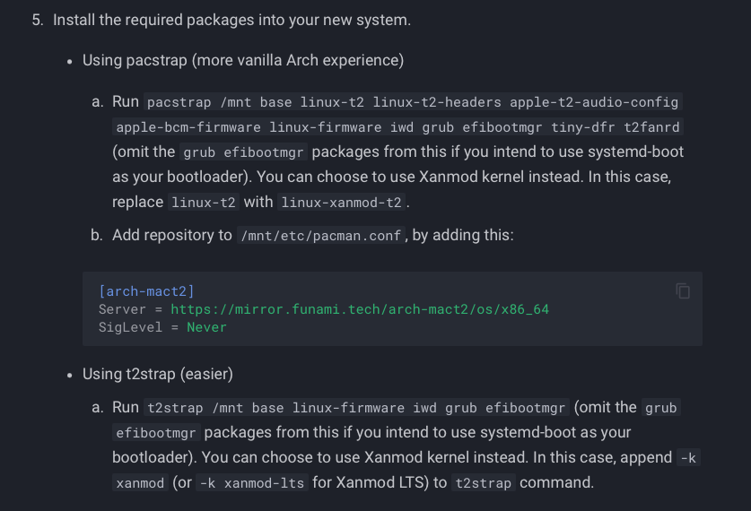

Tämä ei onnistunut:


Googlailtuani ajoin seuraavan komennon (komento löytyi tästä videosta: https://www.youtube.com/watch?v=BWUqPzjZrSs):


Nyt komento t2strap /mnt base linux-firmware iwd grub efibootmgr meni läpi:


### Fstab

Seuraavaksi tein DBARCH-vieon ja wiki.archlinux ohjeilla file system tablen:


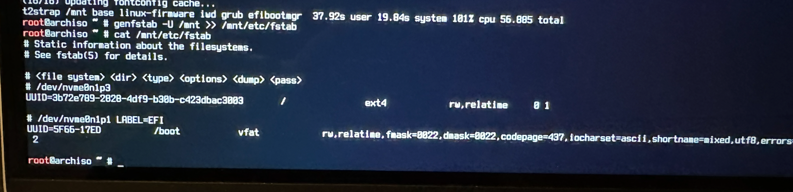

## chroot


### swap

Seuravaksi tein DBARCH-videon ohjeilla swap-filen


yritin asentaa nanon chrootissa, mutta se ei onnistunut:


Pääsin kyllä nettiin niinkuin kuvasta näkyy mutta asennus ei onnistunut, koska "could not registe... (database already registered)". Olin hämilläni, ja palasin GPT:n mukaan "live environment" ja siellä nanon asentaminen onnistui. 

Nano ei kulje chrootiin live environmentista

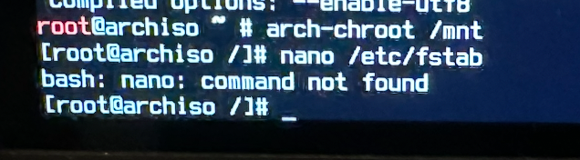

Ihmettelin myös miksi root eteen tulee välillä numeroita.


Seuraavaksi koitin asentaa pacstrap nanon /mtn directoryyn:


Tämän jälkeen pääsin muuttamaan fstab fileä DBARCH-videon ojeiden mukaiseksi


### timezone

timezone listaus ei toiminut

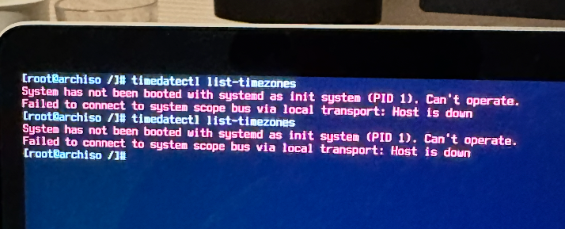

Kun en nähnyt listausta, niin kysyin GPT:ltä mitä arvot voisivat olla ja asensin siltä pohjalta

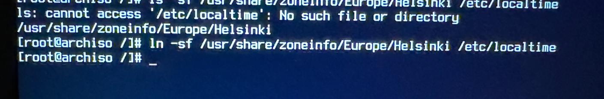


### Localization

Seurasin DBRACH-vieon ja wiki.arch


### Hostname

Seurasin DBRACH-vieon ja wiki.arch

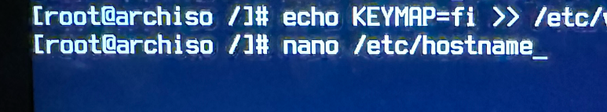

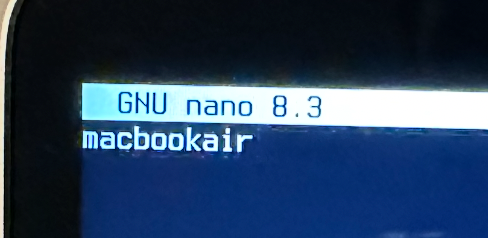

Pääsee komennolla: nano /etc/hosts

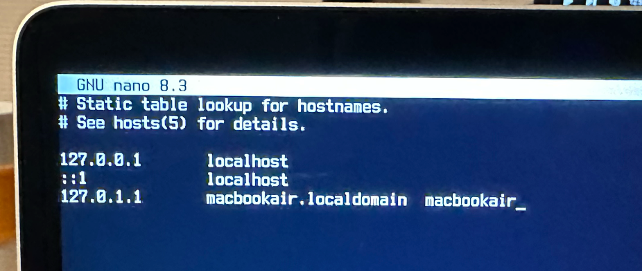

### root salasana

Seurasin DBRACH-vieon ja wiki.arch


### apple-bce 

t2linux.org ohjeesta


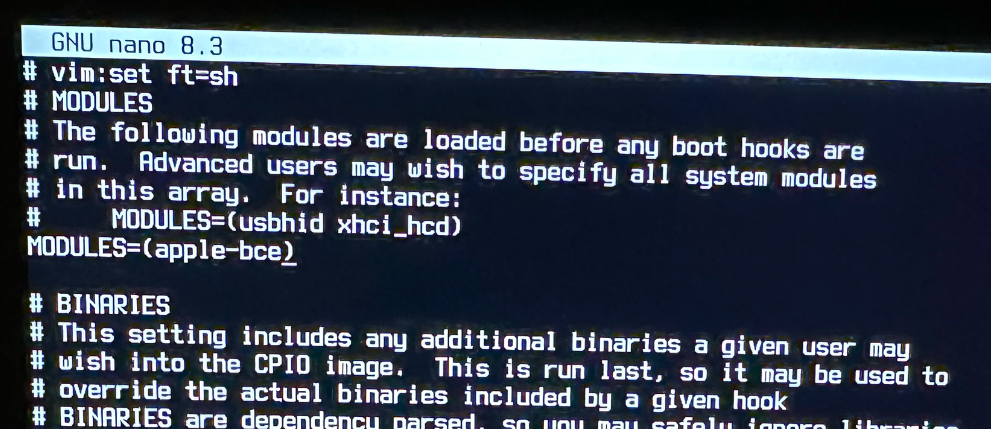

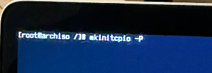


### Enable t2fanrd and tiny-dfr

t2linux.org ohjeesta

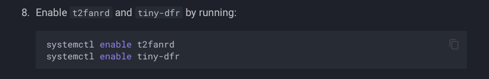

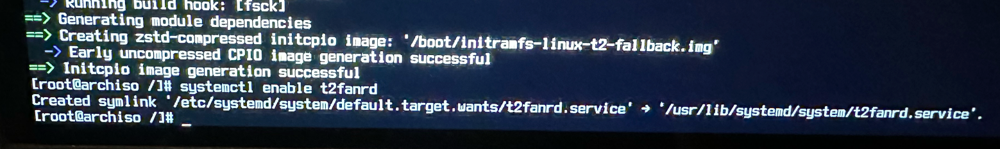

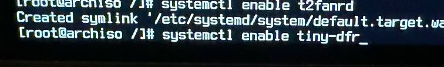

Edellinen komento ei onnistunut, mutta en ole varma johtuuko siitä, että tässä Air:ssa ei ole touchbaria mikä löytyy sitten taas vastaavasta t2 chipin pro:sta.

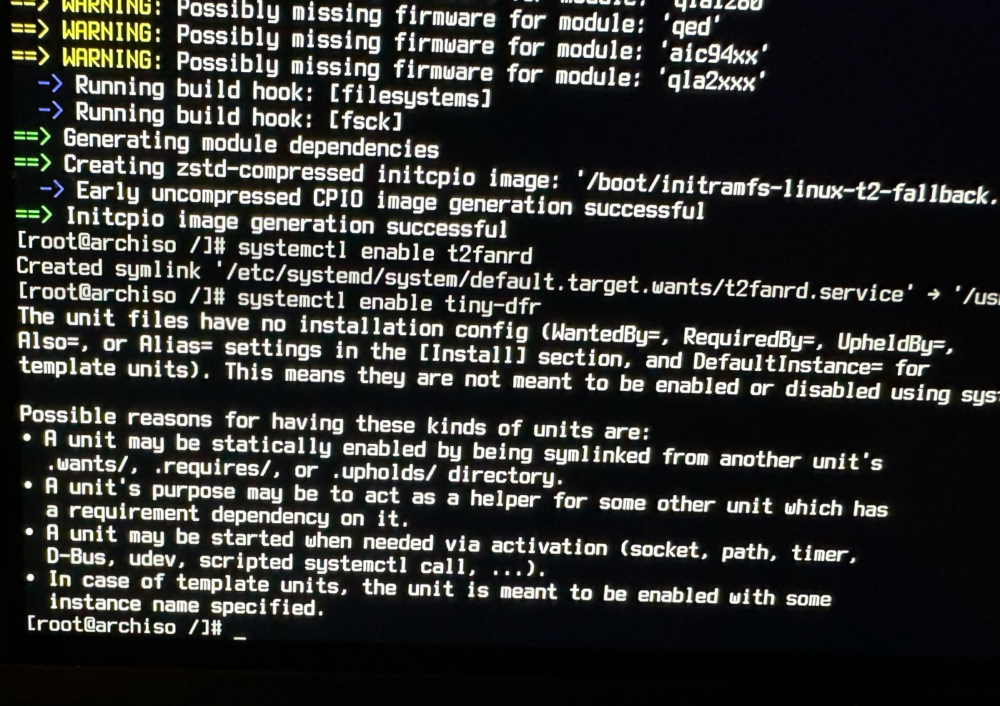


### Bootloader


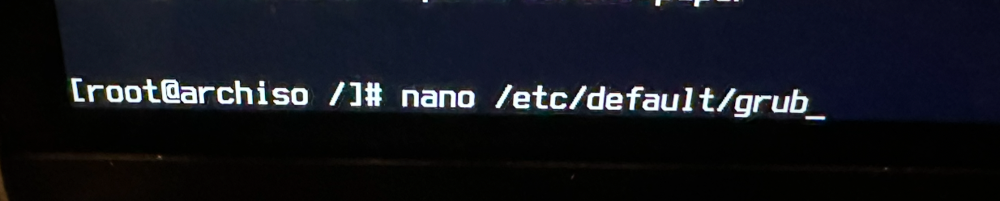

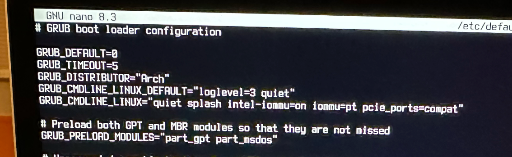

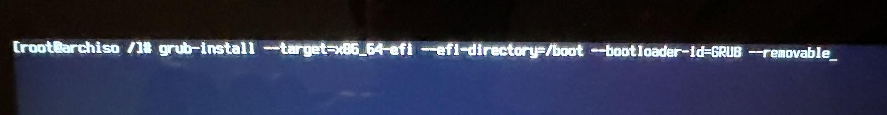

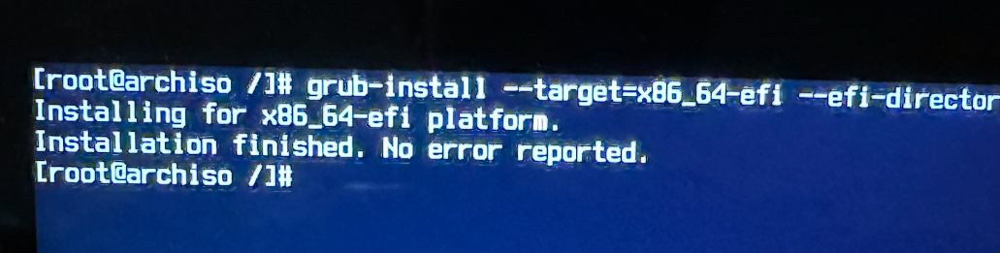


## Starting Arch Linux


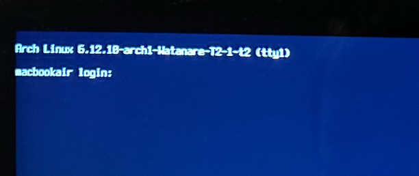

### Säätöä

Rootilla pystyi kirjatumaan, mutta en päässyyt enää tty:ssä nettiin, joten en pystynyt asentamaan mitään. Menin takasin asennukseen ja mountasin molemmat partitionit niin kuin aiemmin. Sen jälkeen yritin asentaa NetworkManaerin, joka asennettiin DBARCH-videolla ja pääsin asentaa myös osan muista paketeista joita videolla asennetaan. Olin siis aiemmin ohittanut tämän koska siitä ei ollut mainintaa t2linux.wikin ohjeissa (jälkeenpäin huomasin, että kyllä oli tai maininta oli wiki.archlinux.orgin ohjeissa). Kuitenkin kun menin chroot niin törmäsin samaan ongelmaan kuin aiemmin reflectorin kanssa (Olin tässä vaiheessa kokonaan unohtanut sen, että olin asentanut nanon chrootiin liven environmentin kautta (onkohan oikea termi sille?) pacstrap komennolla, joten jatkoin  chrootin pacmaniin liittyvän ongelman selvittämistä):


Koitin ratkaista ensimmäistä ongelmaa ja googlailun jälkeen päädyin poistamaan jostain syystä dublikoituneita rivejä pacman.conf tiedostosta: 

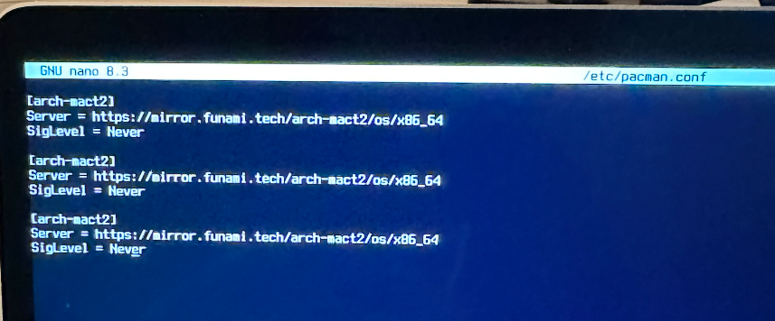

Muutin myös t2wikin ohjeen mukaan kehotuksen eu käyttäjille vaihtaa osoite.

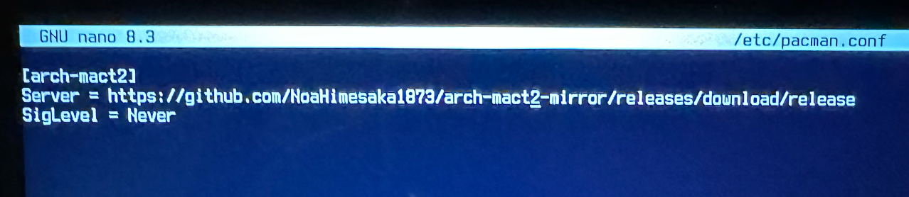

Aiemmat database errorit poistuivat, mutta targetit errorit jäivät jäljelle. googlainul jälkeen muutin pacman.conf filen tälläiseksi :

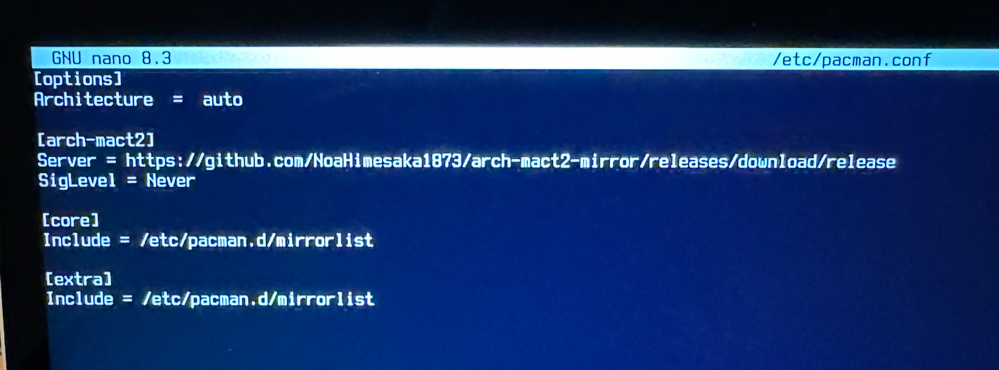

Tämän jälkeen asennukset onnistuivat.

En tiedä miksi chroot:in pacman.conf file alunperin dublikoinut ja ehkä tyhjentänyt itsensä.


## Takaisin tty

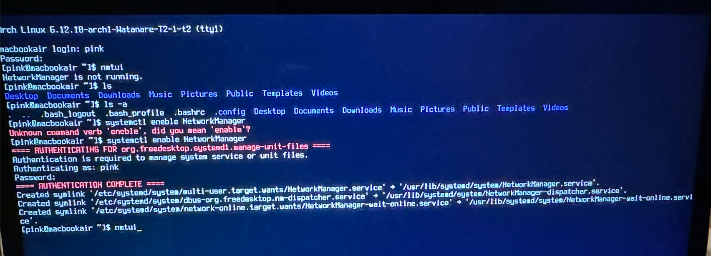

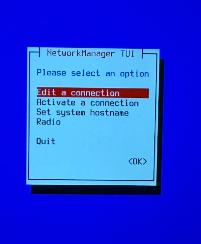

Seuraavaksi kävi niin, että NetworkManager kyllä löysi kaikki alueeni verkot, mutta ei jostain syystä hyväksy oikeaa salanaa vaan ilmoitaa, että credentialsit puuttuvat. 

Seuraavaksi seurasin ohjeita tältä sivulta: https://vhs.codeberg.page/post/dual-boot-archlinux-mbp-t2/. Jätin siis NetworkManagerni ja käytin iwd:tä ja pääsin nettiin. Tämän olisi varmaan voinut tehdä aikaisemminkin...

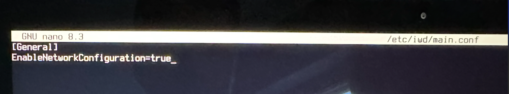


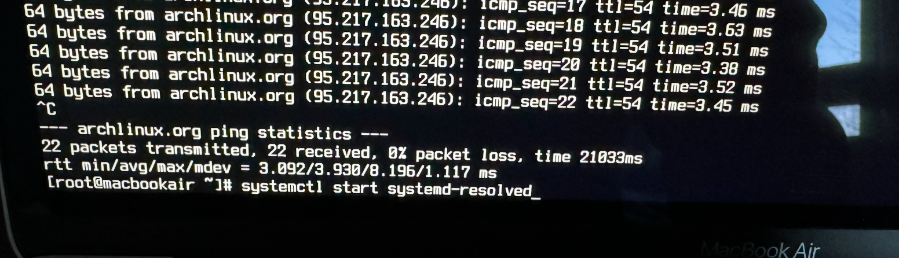


### Käyttäjänimi ja salasan

Muutin aiemmin tehdyn käyttäjänimen "pink" oikeudet  


### Desktop envinronment

Googlainun perusteella poimein DBARCH-videolta seuraavat paketit: 


Asennus kysyi monta kertaa halutuista paketeista:


Kun asennus oli valmis enableasin sddm


tadaa!


### Testaus

Trackpadi ja näppäimistö toimii. NetworkManager on samassa tilanteessa kuin tty ja se vaatii selvittämistä. Nettiä lukuunottamatta toimii mielestäni todella hyvin.  

---

## Lähteet

Tero Karvinen. Linux Palvelimet 2025 alkukevät: https://terokarvinen.com/linux-palvelimet/
