# Tehtävä h3

### x) Lue ja tiivistä 

The Apache Software Foundation 2023: Apache HTTP Server Version 2.4 Documentation: [Name-based Virtual Host Support](https://httpd.apache.org/docs/2.4/vhosts/name-based.html)

- Virtual hosting mahdollistaa sen, että samalle tietokoneelle voidaan kerätä useita web-sivustoja samalle palvelimelle (lähde: [wikipedia www-palvelin](https://fi.wikipedia.org/wiki/WWW-palvelin)). 
- IP-pohjainen virtuaalinen host käyttää IP osoitteita määrittämään oikean hostin. Tällöin jokaisella hostilla pitää olla oma erillinen IP-osoite.
- Nimi pohjaisessa (name-based) virtual hostingissa serveri nojaa siihen, että client imoittaa hostnamem osana HTTP headerseja. Näin eri hostit voivat jaa saman IP osoitteen.
- Name based virtual hostingissa DNS server pitää konfiguroida ohjaamaan jokainen hostname oikeaan IP osoitteeseen ja tämän jälkeen konfiguroida Apache HTTP serveri tunnistamaan eri hostnamet.
- Name-based virtual hosting vähentää tarvetta useammalle IP osoitteelle.

Karvinen 2018: [Name Based Virtual Hosts on Apache – Multiple Websites to Single IP Address](https://terokarvinen.com/2018/04/10/name-based-virtual-hosts-on-apache-multiple-websites-to-single-ip-address/)

- Usein sinulla on yksi IP osoite, jolla on useita web-sivuja. 
- Apachella on mahdollista toteuttaa useampi domain nimi yhdellä IP-osoitteella.

---

#### Laite jolla tehtävät tehdään

- Apple MacBook Pro M2 Max
- macOS Sequoia 15.2
- Parallels ARM Virtual Machine
- Debian GNU/Linux 12.6


---

### a) Testaa, että weppipalvelimesi vastaa localhost-osoitteesta. Asenna Apache-weppipalvelin, jos se ei ole jo asennettuna.

Asensin itselleni uuden virtuaalikoneen edellisen tunnin jälkeen, joten asennan palvelimen uudelleen.

```
sudo apt-get install apache2
```

```
sudoedit /etc/apache2/sites-available/esim.example.com.conf
```

```
<VirtualHost *:80>
 ServerName esim.example.com
 ServerAlias www.esim.example.com
 DocumentRoot /home/petteri/public_sites/esim.example.com
 <Directory /home/petteri/public_sites/esim.example.com>
   Require all granted
 </Directory>
</VirtualHost>
```

```
sudo a2ensite esim.example.com
```
```
sudo a2dissite 000-default.conf
```

```
sudo systemctl restart apache2
```

```
mkdir -p /home/petteri/public_sites/esim.example.com/
```
```
echo testi > /home/petteri/public_sites/esim.example.com/index.html
```

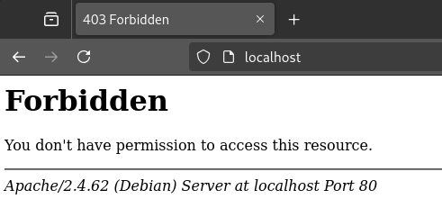

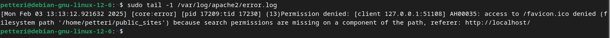

Tunnilla oli sama tilanne ja [löysin](https://askubuntu.com/questions/451922/apache-access-denied-because-search-permissions-are-missing) silloin tämän mielestäni siistin komennon:

```
namei --modes /home/petteri/public_sites
```

ja sen tulos:

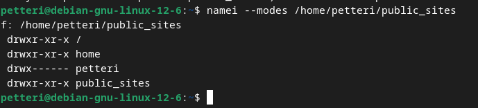

Karvisen [ohjeiden](https://terokarvinen.com/linux-palvelimet/) oheita mukaillen käytin komentoa:

```
sudo chmod ugo+x /home/petteri
```

Tämän jälkeen:

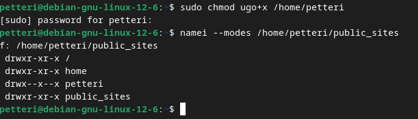

Käynnistettyäni apachen uudelleen:

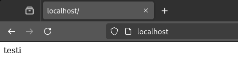

---

### b) Etsi lokista rivit, jotka syntyvät, kun lataat omalta palvelimeltasi yhden sivun. Analysoi rivit (eli selitä yksityiskohtaisesti jokainen kohta ja numero, etsi tarvittaessa lähteitä).


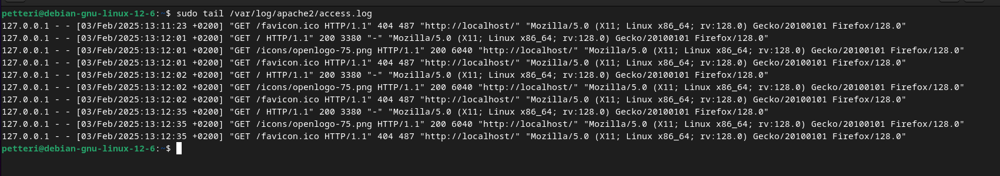

Yhdellä pyynnöllä tulee kolme logia:

127.0.0.1 - - [03/Feb/2025:13:12:35 +0200] "GET / HTTP/1.1" 200 3380 "-" "Mozilla/5.0 (X11; Linux x86_64; rv:128.0) Gecko/20100101 Firefox/128.0"

127.0.0.1 - - [03/Feb/2025:13:12:35 +0200] "GET /icons/openlogo-75.png HTTP/1.1" 200 6040 "http:\//localhost/" "Mozilla/5.0 (X11; Linux x86_64; rv:128.0) Gecko/20100101 Firefox/128.0"

127.0.0.1 - - [03/Feb/2025:13:12:35 +0200] "GET /favicon.ico HTTP/1.1" 404 487 "http:\//localhost/" "Mozilla/5.0 (X11; Linux x86_64; rv:128.0) Gecko/20100101 Firefox/128.0"


#### 127.0.0.1

-  localhostin IPv4 loopback osoite (lähde: [wikipedia: localhost](https://en.wikipedia.org/wiki/Localhost)).

#### "GET /favicon.ico HTTP/1.1" 404 487 

- GET pyyntö /favicon.ico:sta HTTP/1.1 protokollalla versio 1.1 [wikipedia: HTTP](https://en.wikipedia.org/wiki/HTTP) statuksella 404 Not Found. 487 tarkoittaa palautetun objektin kokoa (ei sisällä response headerseja)  [apache.org](https://httpd.apache.org/docs/2.4/logs.html)

#### "http\://localhost/"

- The "Referer" (sic) HTTP request header. Sivu jota client jota haki [apache.org](https://httpd.apache.org/docs/2.4/logs.html)

#### "Mozilla/5.0 (X11; Linux x86_64; rv:128.0) Gecko/20100101 Firefox/128.0"

- The User-Agent HTTP request header. Client selaimen itsestään ilmoittamat tiedot [apache.org](https://httpd.apache.org/docs/2.4/logs.html)

- seuraavassa kahdessa pyynnössä oleva 200 on pyynnön OK status.


### c) Etusivu uusiksi.

```
sudoedit /etc/apache2/sites-available/hattu.example.com.conf
```

```
<VirtualHost *:80>
 ServerName hattu.example.com
 ServerAlias www.hattu.example.com
 DocumentRoot /home/petteri/public_sites/hattu.example.com
 <Directory /home/petteri/public_sites/hattu.example.com>
   Require all granted
 </Directory>
</VirtualHost>
```

```
sudo a2ensite hattu.example.com
```
```
sudo a2dissite esim.example.com.conf
```

```
sudo systemctl restart apache2
```

```
mkdir -p /home/petteri/public_sites/hattu.example.com/
```
```
echo "<h1>hattu</h1>" > /home/petteri/public_sites/hattu.example.com/index.html
```

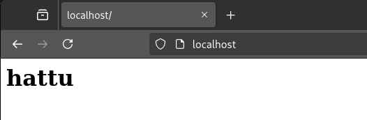
Sivun muokkaaminen onnistuu ilman sudoa:
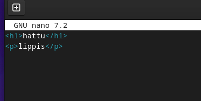
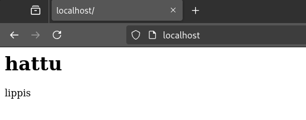


### e) Tee validi HTML5 sivu.

templatena käytin Tero Karvisen [esimerkkiä](https://terokarvinen.com/2012/short-html5-page/).

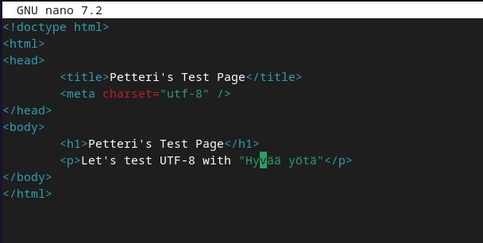
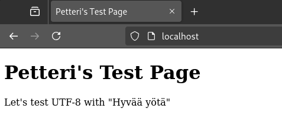
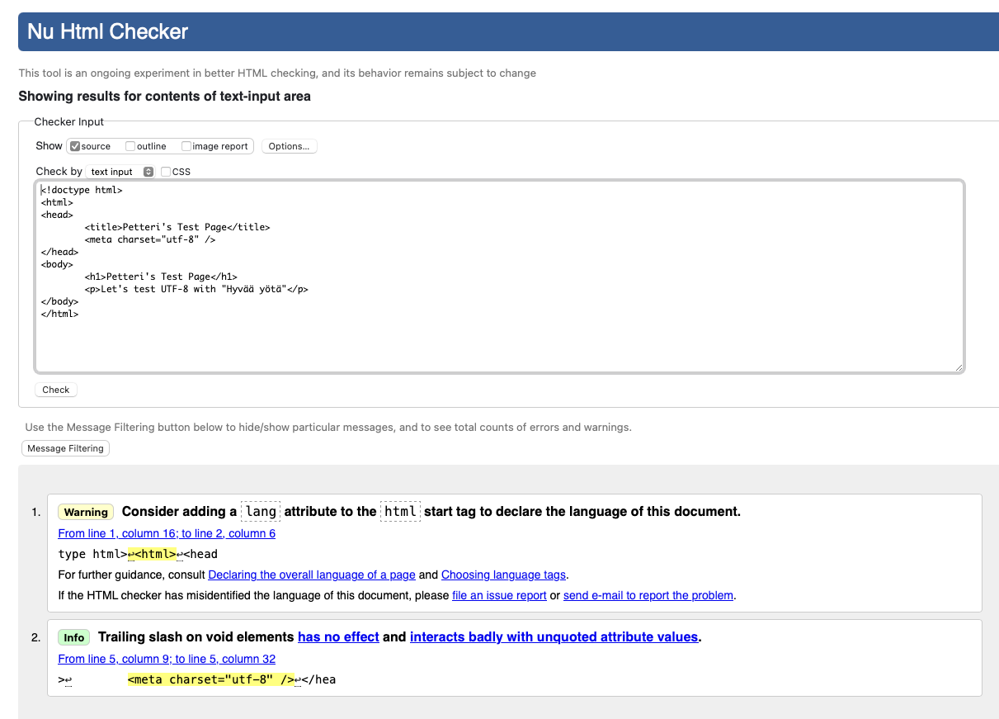

Korjausten jälkeen
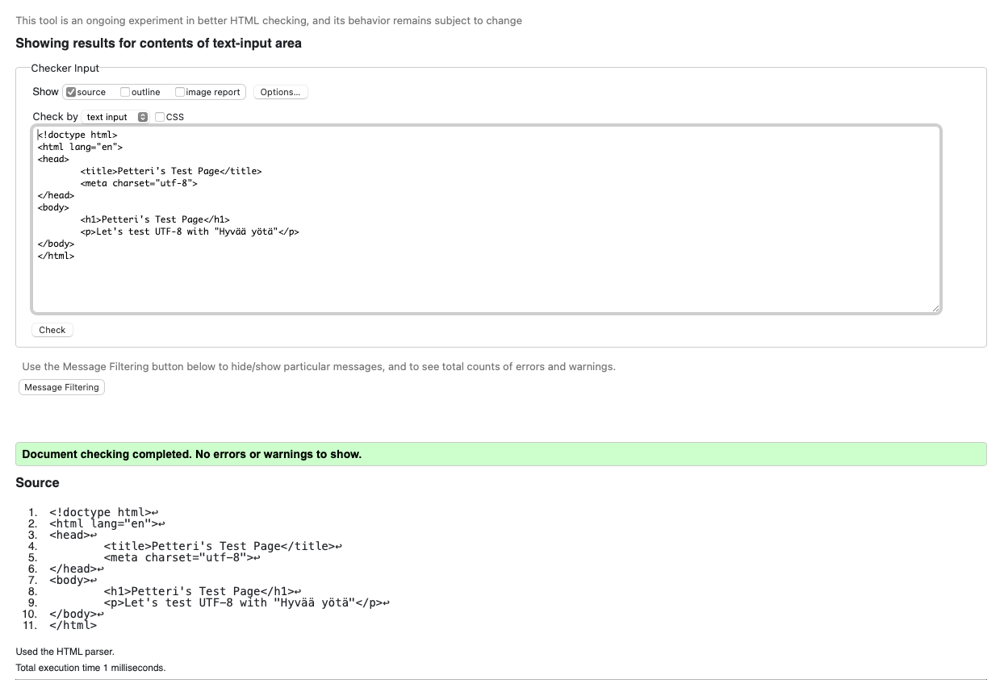


### f) Anna esimerkit 'curl -I' ja 'curl' -komennoista. Selitä 'curl -I' muutamasta näyttämästä otsakkeesta (response header), mitä ne tarkoittavat.

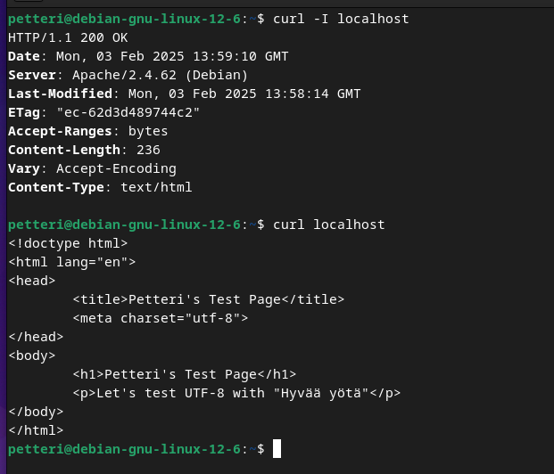

ETag - entity tag, joka yksilöi tietyn version resurssista. Parantaa cachen toimintaa ja säästää bandwithia. Estää myös samanaikaisia päivityksiä kirjoittamasta toistensa yli. Lähde: [mdn](https://developer.mozilla.org/en-US/docs/Web/HTTP/Headers/ETag).

Accept-Ranges - Accept-Ranges headerilla ilmoittaa, että serveri pystyy jatkamaan häirittyä latausta ilman, että clientin täytyy käynnistää siirtoa kokonaan alusta. Lähde: [mdn](https://developer.mozilla.org/en-US/docs/Web/HTTP/Headers/Accept-Ranges).

Vary - Vary headerin sisältyminen varmistaa, että responset ovat erikseen cached riippuen headereista, jotka on listattu vary kentässä. Useimmiten tätä käytetään cache avainten tekoon kun content negoation on käytössä. Lähde: [mdn](https://developer.mozilla.org/en-US/docs/Web/HTTP/Headers/Vary).


### m) Hanki GitHub Education -paketti.

On jo.


### o) Laita sama tietokone vastaamaan kahdellla eri sivulla kahdesta eri nimestä.

Ajattelin että käytän aiemapaa esim.examplea.com ja hattu.example.com.

Ensin:

```
sudo a2ensite esim.example.com
```
```
sudo systemctl restart apache2
```

etc/host näytti tältä

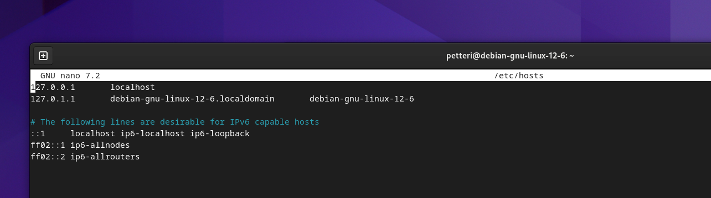

Muutin sen tälläiseksi, eli kuten [ohjeissa](https://terokarvinen.com/linux-palvelimet/) neuvottiin tekemään yhdellä sivulla, mutta nyt laitoin molemmat sivut:

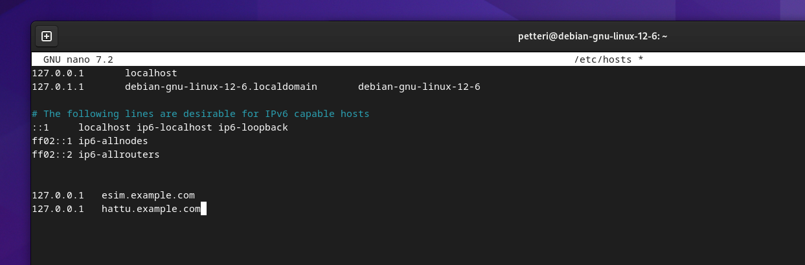


Tämän jälkeen:

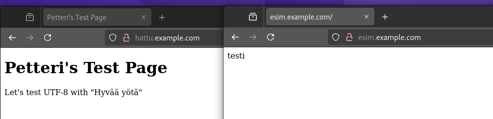
