# Tehtävä h4 Maailma kuulee

### x) Lue ja tiivistä.

[Susanna Lehto 2022: Teoriasta käytäntöön pilvipalvelimen avulla (h4)](https://susannalehto.fi/2022/teoriasta-kaytantoon-pilvipalvelimen-avulla-h4/) (opiskelijan esimerkkiraportti), kohdat

a) Pilvipalvelimen vuokraus ja asennus

- GDPR:n ja mahdollisesti nopeamman toimivuuden kannalta palvelin sijainti kannattaa valita läheltä.

d) Palvelin suojaan palomuurilla

- sudo apt-get install ufw
- sudo ufw allow 22/tpc
- sudo ufw enable

e) Kotisivut palvelimelle

- Tulee tehdä uusi käyttjä, asettaa tällä sudo oikeudet ja lukita root.

f) Palvelimen ohjelmien päivitys

- sudo apt-get update
- sudo apt-get upgrade
- sudo apt-get dist-upgrade


Karvinen 2012: [First Steps on a New Virtual Private Server – an Example on DigitalOcean and Ubuntu 16.04 LTS](https://terokarvinen.com/2017/first-steps-on-a-new-virtual-private-server-an-example-on-digitalocean/)

- Vain ensimmäisellä kirjautumiskerralla tulee käyttää root käyttäjää. Muuta käyttöä varten tulee luoda uusi käyttäjä.
- Tulee käyttää vain vahdoja/hyviä salasanoja.
- Firewall tehdään reikä ja se laitetaan päälle.
- Tehdään uusi käyttäjä
- Lukitaan root käyttäjä
- Tehdään päivitykset.


### a) Vuokraa oma virtuaalipalvelin haluamaltasi palveluntarjoajalta.

Halusin vuokrata palvelimen AWS:ltä ja ensiksi kirjauduin sisään AWS consoleen IAM-userilla, jonka olen aiemmin tehnyt (en siis käytä root-käyttäjätunnustani). 

AWS kutsuu virtuallipalvelimia EC2-instansseiksi ja valitsin itselleni sellaisen. 

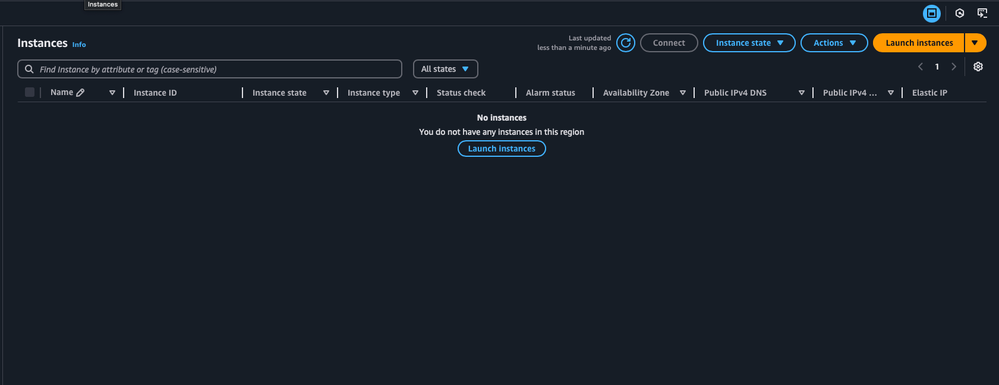

Annoin nimeksi Petteri Web Server ja valitsin Debianin Free tier kelvollisella vaihtoehdolla.

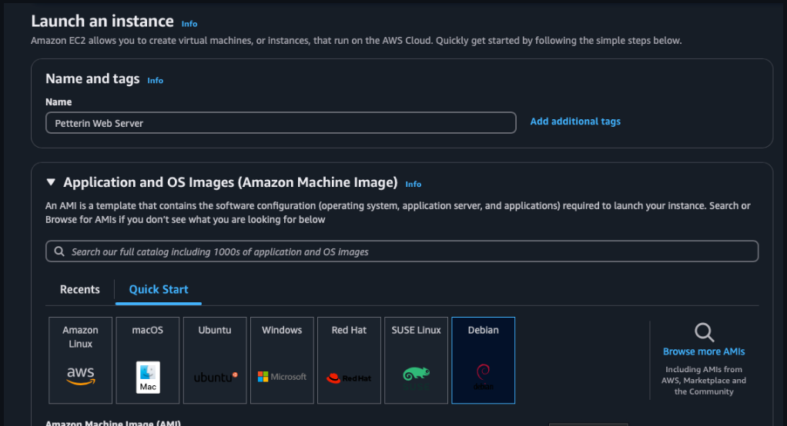

Seuraavaksi tein itselleni avain parin, jotta voilla voisin myöhemmin käyttää SSH-yhteyttä.

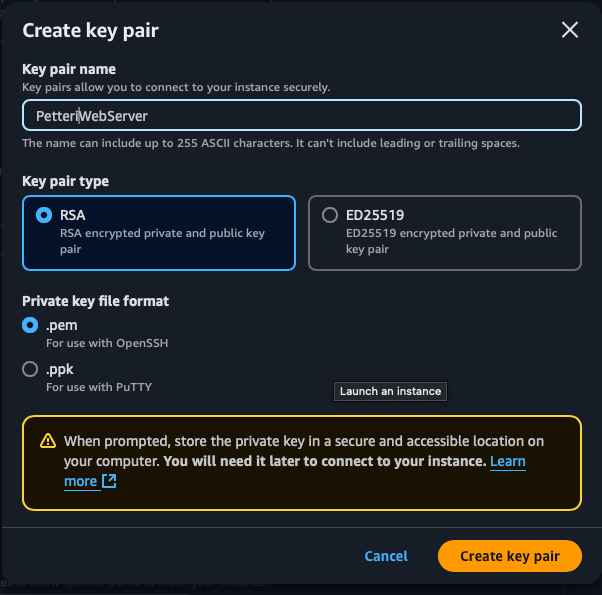

Sallein SSH yhteyden ja annoin instanssin luoda automaattisesti uuden Security Groupin. Instanssin luominen oli valmis.

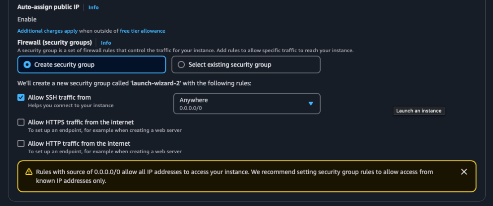

### b) Tee alkutoimet omalla virtuaalipalvelimellasi: tulimuuri päälle, root-tunnus kiinni, ohjelmien päivitys.

Ensiksi yhdistin itseni SSH:lla äsken luomaani instanssiin. AWS antaa tähän suoraan ohjeet.

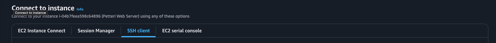

Vaikka AWS tarjoaakin ymmärtääkseni Security Groupin kautta virtuaalisen palomuurin päätin silti asentaa EC2-instansilleni palomuurin. Pääsin myös vaihtaa käyttäjän. 


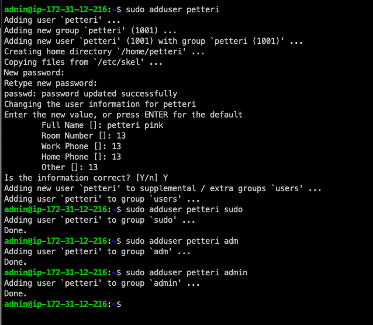

Tämä ei toiminut, mikä olikin oletettavaa. Yritin siis yhdistää samoilla avaimilla käyttähän petteri, millä olin yhdistänyt admin-käyttäjän.

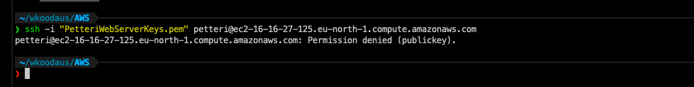

Pienen tutkinnan jälkeen näillä ohjeilla jatkoin eteenpäin:

https://repost.aws/knowledge-center/new-user-accounts-linux-instance

https://www.youtube.com/watch?v=gpurd3Av5S8

Tein uudet avaimet:

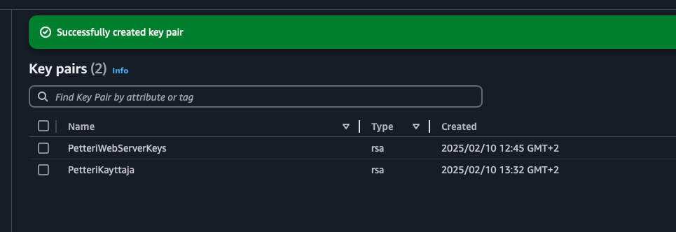

Tein uudella avaimella komennon:

```
ssh-keygen -y 
```

ja jatkoin ohjeiden mukaan vaihtaen käyttäjän AWS:n EC2:ssa:

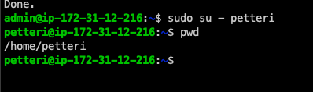

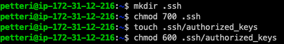

Komennolla :
```
cat >> .ssh/authorized_keys 
```

aukesi kenttä johon pystyi pastettamaan aiemmalla ssh-keygen -y komennolla saadun tulosteen. Näin avain kopioitui käyttäjän petteri .ssh/authorized_keys hakemistoon.

Nyt pääsin SSH:lla petteri-käyttäjällä AWS:n EC2-instansilleni.

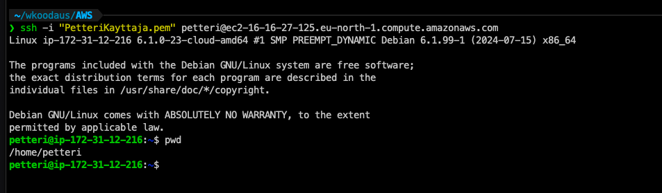

Seuraavaksi lukitsin root:n (tietäen, että olin aiemmin käyttänyt defaulttina olevaa adminia, enkä root. Päätin jättää admin-käyttäjän vielä toistaiseksi auki tässä vaiheessa.)

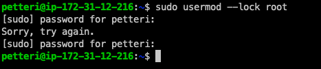

Seuraavaksi laitoin palomuurin päälle, vaikka Security Groupin pitäisi kyllä jo ymmärtääkseni toimia palomuurina, mutta koska en ollut varma ja halusin kokeilla niin laitoin muurin päälle. 

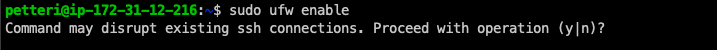

Olin luottavainen siihen, että yhteys toimisi, koska porttien pitäisi olla oikein.

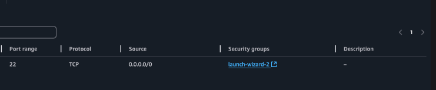

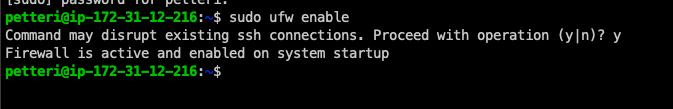

En oikein tiennyt miten saisin "...and enabled on sytem startup". Olisi pitänyt tutkia tätä tarkemmin, mutta ajoin komennon sudo systemctl restart sshd gpt:n vastauksen perusteella. Pitää tutkia tätä vielä ja kysyä tunnilla. 

Tämän jälkeen laitoin komennon:

```
sudo ufw status verbose
```


Seuraavaksi asensin:
```
sudo apt-get -y dist-upgrade
```


### c) Asenna weppipalvelin omalle virtuaalipalvelimellesi. Korvaa testisivu. Kokeile, että se näkyy julkisesti. Kokeile myös eri koneelta, esim kännykältä. (Jos haluat tehdä oikeat weppisivut, tarvitset Name Based Virtual Hostin)

Seuraavaksi asensin Apachen:

```
sudo apt-get install apache2
```

Ja apachen tila komennolla:

```
sudo systemctl status apache2
```

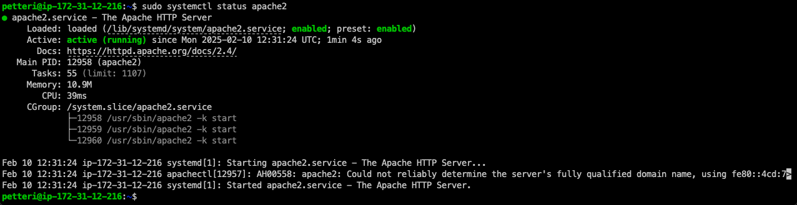


Avasin palomuuriin uuden portin:

```
sudo ufw allow 80/tcp
```

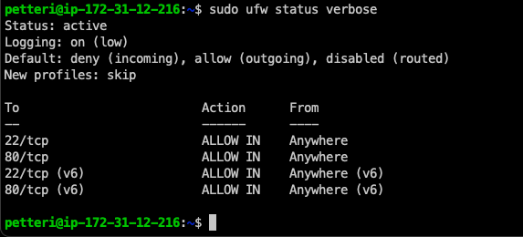

Yhteyden ei pitäis onnistua, eikä se onnistukkaan, koska AWS:n Security Group estää sen. 

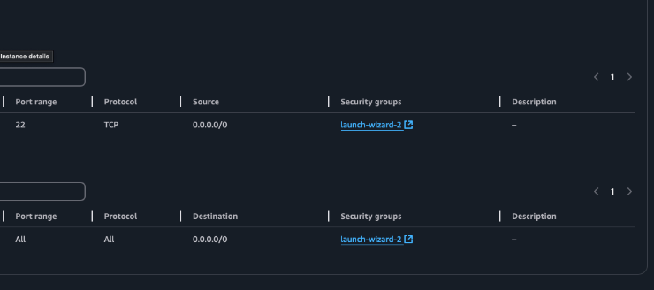

Security Groupin muokkauksen jälkeen (Security Group voi muokata vaikka alla olevan kuvan linkistä "sg-060b9ae1d2896b0d4 (launch-wizard-2)") :

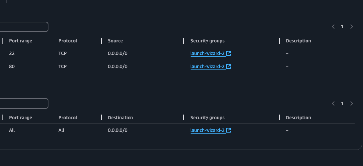

Näin default sivu näkyy EC2-instanssin julkisessa IP-osoitteessa:

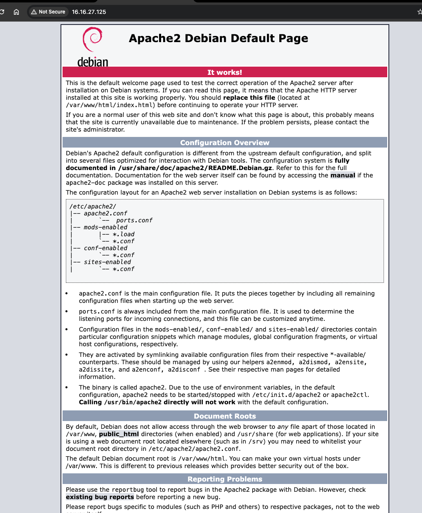

Seuraavaksi tämän sivun sisältöä tuli muuttaa. Ajoin komennon (jonka kopioin [Susannan ohjeesta](https://susannalehto.fi/2022/teoriasta-kaytantoon-pilvipalvelimen-avulla-h4/):

```
echo Hello world! | sudo tee /var/www/html/index.html
```

Jonka jälkeen:


### d) Vapaaehtoinen: Laita omalle julkiselle palvelimellesi uusi Name Based Virtual Host. Kun sammutat muut weppisivut, niin se ainut näkyy nimestä riippumatta etusivulla. Name Based Virtual Host avulla pääset muokkaamaan kotisivuja normaalilla käyttäjällä, ilman sudoa.


```
sudoedit /etc/apache2/sites-available/pinkkila.com.conf
```

```
<VirtualHost *:80>
 ServerName pinkkila.com
 ServerAlias www.pinkkila.com
 DocumentRoot /home/petteri/public_sites/pinkkila.com
 <Directory /home/petteri/public_sites/pinkkila.com>
   Require all granted
 </Directory>
</VirtualHost>
```

```
sudo a2ensite pinkkila.com
```

```
sudo a2dissite 000-default.conf
```

```
sudo systemctl restart apache2
```

```
mkdir -p /home/petteri/public_sites/pinkkila.com/
```
```
echo "<h1>Pinkkila</h1>" > /home/petteri/public_sites/pinkkila.com/index.html
```

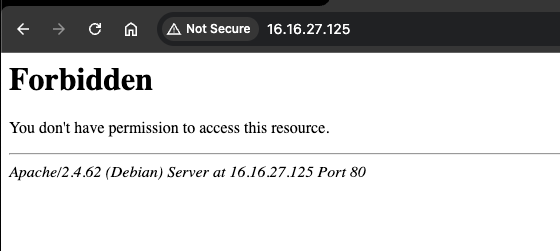

Mulla oli sama tilanne omalle virtuaalikoneella paikallisesti ja joku oli palautteessa laittanut, että käyttäjä kansion oikeuksien muuttamisessa voi olla jotain. En ehtinyt viime tunnilla kysyä Karviselta asiaa tarkemmin, mutta nyt aioin näillä tiedoin kuitenkin muuttaa hakemiston petteri oikeuksia. 

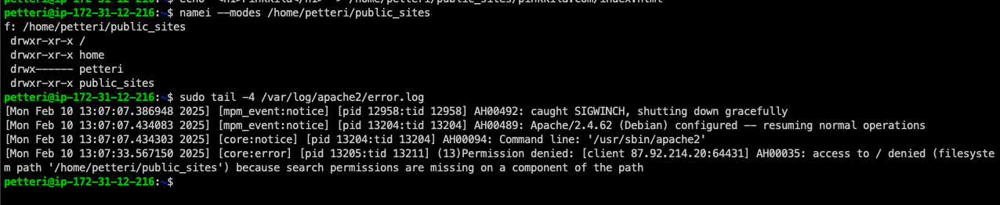

Käytin komentoa [(lähde)](https://www.geeksforgeeks.org/set-file-permissions-linux/):

```
sudo chmod o+x /home/petteri
```

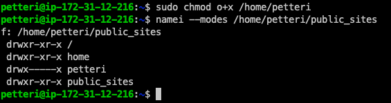

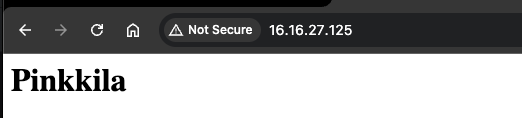


Mitäköhän nyt tapahtuu, jos lisään samalla tavalla /etc/hosts kansioon rivin kuin edellisessä tehtävässä?

```
sudoedit /etc/hosts
```

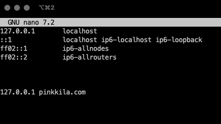

No ei mitäään tietenkään, kun ei se ole missään dns:ssä haha 😂 (otamme tuon aiemmin lisätyn rivin hiljaa pois).

AWS:n Route 53 palvelu mahdollistaa ymmärtääkseni IP-osoitteiden routtaamisen domainnimille ja minun piti tehdäkkin se, mutta se osoittaituikin ehkä hiukan monimutkaisemmaksi ja vaatii näillä näkymin ainakin itseltä perehtymistä. 


