# Tehtävä h5 - Nimekäs

#### Laite jolla tehtävät tehdään:

- Apple MacBook Pro M2 Max
- macOS Sequoia 15.3.1

Tehtävät ovat Tero Karvisen opintojaksolta Linux palvelimet ja löytyvät osoitteesta: https://terokarvinen.com/linux-palvelimet/.

### a) Nimi. Laita julkinen nimi osoittamaan omaan koneeseesi.

Edellisestä [h4 tehtävästäni](https://github.com/pinkkila/linux-course/blob/main/tehtava-h4.md) minulla oli valmiina AWS:n palvelimella nettisivu pyörimässä, jolle päätin laittaa tehtävän mukaisen julkisen nimen.  

Olin jo aiemmin ostanut vuokrannut AWS:stä itselleni oman sukunimeni mukaisen domainin ja päätin käyttää sitä. AWS:ssä nimiin liittyvät palvelut ovat Route 53 nimisen palvelun alla, josta pystyn tarkistamaan myös vuokraamiani nimiä:

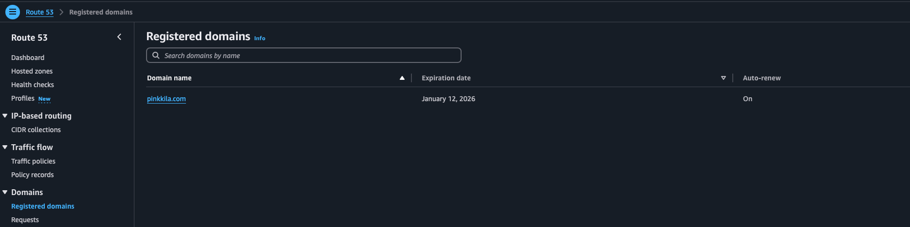

Nimen vuokraaminen AWS:n kautta oli suht helppoa, eikä vaatinut kuin omien tietojen syöttämistä. Hinta valitsemalleni nimelle oli vuodeksi 14 dollaria plus verot.

Ainakin omasta mielestäni AWS:n palveluissa on aina oma selvittämisensä siinä, millä nimellä mitäkin palvelua kutsutaan, mitä sillä voi tehdä ja miten. Kun vuokrasin nimen katsoin tämän Tiny Tecnical Tutorialsin [videon](https://www.youtube.com/watch?v=JRZiQFVWpi8&t=396s). Tuota samaa videota tulen varmastikkin käyttämään useamman kerrankin lähteenä ja jatkossa käytän siitä nimeä "TTT-video". 

Tunnilla käydyn perusteella tiesin, että minun tulisi tehdä A Record. A Record:a käytetään linkittämään domain IP-osoitteeseen. Lähde TTT-video.

TTT-videon ohjeilla pystyin tekemään tämän aika helposti:

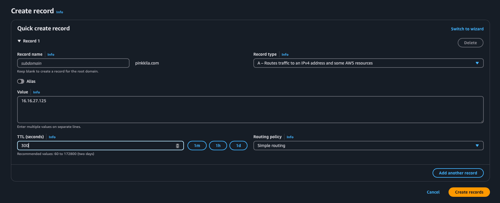

- Recordin nimeksi en laittanut mitään, koska halusin käyttää root domainia. 

- Valueen tuli EC2-instanssini public IP-osoite. Lähde: TTT-video.

- TTL (time to live): "The amount of time, in seconds, that you want DNS recursive resolvers to cache information about this record." Lähde: AWS [Values specific for simple records](https://docs.aws.amazon.com/Route53/latest/DeveloperGuide/resource-record-sets-values-basic.html)

- Routing policy: Simple routing on yksinkertainen standardi DNS toiminnallisuus. Lähde: AWS [Simple Routing](https://docs.aws.amazon.com/Route53/latest/DeveloperGuide/routing-policy-simple.htmlf)

Nyt osoite `http://pinkkila.com/` menee EC2-instannisillani olevalle Apache-serverin nettisivulle. 

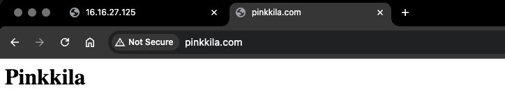

Meneekö (ei varmastikkaa mene) osoite `www.pinkkila.com` EC2-instanssiin?

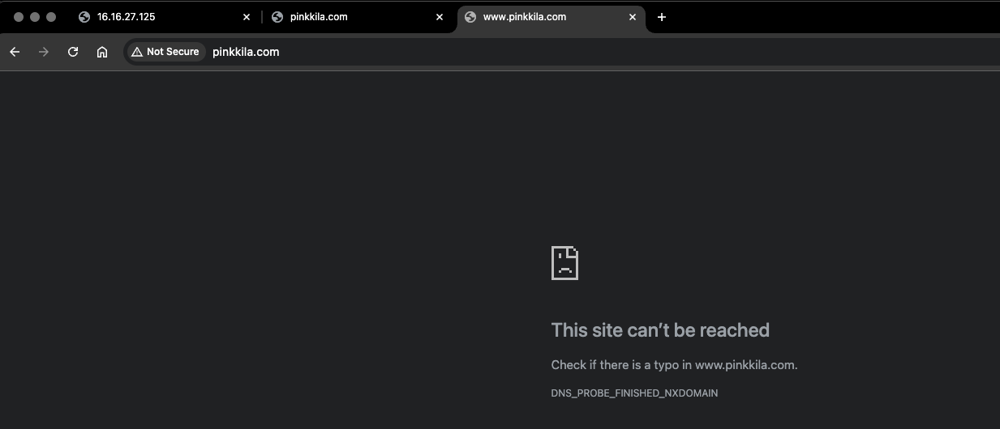

Ei mennyt joten tehdään kuten tässä [ohjeessa](https://aws.amazon.com/awstv/watch/47ebee0e261/):

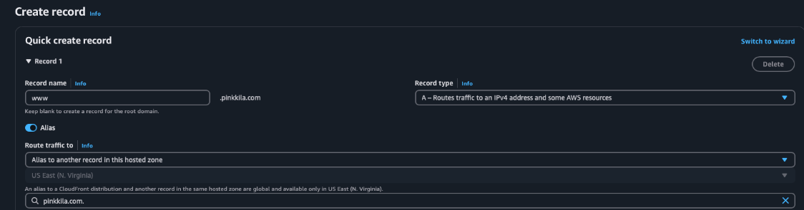

Ja hetken päästä toimi:

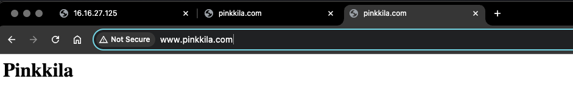

### b) Based. Laita Name Based Virtual Host näkymään uudessa nimessäsi. Kotisvuja pitää pystyä muokkaamaan ilman pääkäyttäjän oikeuksia.

Tämä minulla on jo ja sivun muokkaus onnistuu ilman pääkäyttäjän oikeuksia.

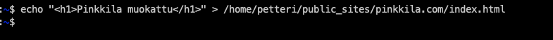

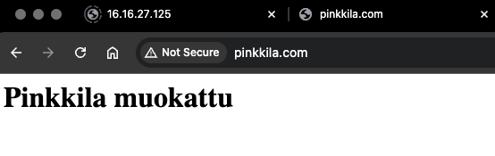

### c) Kotisivu. Tee vähintään kolmen erillisen alasivun (esim. index.html, blog.html, projects.html) kotisivu ja kopioi se näkymään palvelimellesi. Sivujen muokkaamisen pitää onnistua ilman pääkäyttäjän oikeuksia, niiden kopioiminen pääkäyttäjänä testisivun paikalle ei käy. Kotisivujen ei tarvitse olla hienoja, mutta niiden tulee olla validia HTML:ää ja linkittää toisiinsa.

Linkkasin sivut vain toisiinsa a-tagilla ja se toimi. 

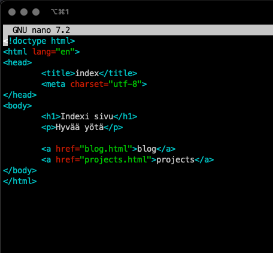

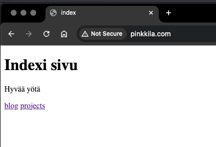

### d) Alidomain. Tee kaksi uutta alidomainia, jotka osoittava omaan koneeseesi. Esimerkiksi palvelu on example.com -> linuxkurssi.example.com. Alidomainit ovat tyypillisesti ilmaisia, kun sinulla on päädomain (example.com). Tässä tehtävässä riittää, että alidomainit avaavat saman sivun kuin päädomain. (Vapaaehtoinen bonus: Tee toinen alidomain A-tietueella ja toinen CNAME-tietueella. Vapaaehtoinen bonus: tee alidomainiin oma erillinen name based virtual host.)

Oletettavastikkin näin:

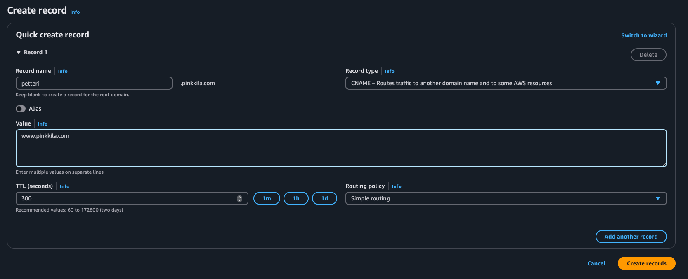

Jolloin:

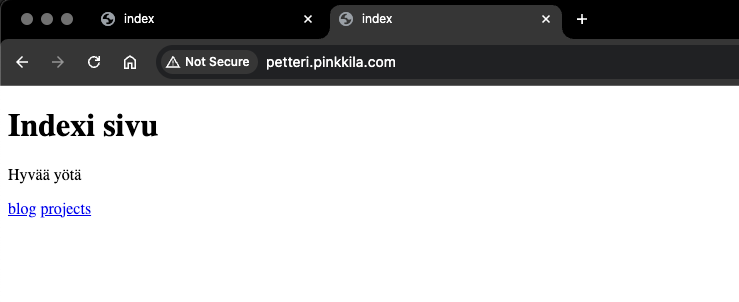

Seuraavaksi kokeilin tehdä aliaksella alidomainin äsken tehdylle cnamelle:

## Lähteet

Tiny Technical Tutorials. Amazon Route 53 Basics Tutorial | Domain Registration, A Records, CNAME Records, Aliases, Subdomains: https://www.youtube.com/watch?v=JRZiQFVWpi8&t=396s

AWS. Simple Routing: https://docs.aws.amazon.com/Route53/latest/DeveloperGuide/routing-policy-simple.html

AWS. Values specific for simple records: https://docs.aws.amazon.com/Route53/latest/DeveloperGuide/resource-record-sets-values-basic.html

AWS. How to Redirect Domains Using Amazon Route 53: A Step-by-Step Guide: https://aws.amazon.com/awstv/watch/47ebee0e261/ 