# h6 Salataampa

### x) Lue ja tiivistä

#### Let's Encrypt 2024: [How It Works](https://letsencrypt.org/how-it-works/)

- Let's Encrypt ja ACME (Automatic Certificate Management Environment Lähde: [rfc8555](https://datatracker.ietf.org/doc/html/rfc8555)) mahdollistaa HTTPS severin ja selaimen hyväksymän sertifikaatin automaattisen asentamisen ilman, että ihmisen tarvitsee olla osana tätä  prosessia. Tämä on mahdollistetaan ajamalla sertifikaatinhallinta-agenttia verkkopalvelimella. 
- Prosessi koostuu kahdesta vaiheesta: ensin agentti todistaa CA:lle (Certificate Authority: lähde wikipedia: [Certificate authority](https://en.wikipedia.org/wiki/Certificate_authority), että verkkopalvelin hallitsee domainia, jonka jälkeen agentti voi pyytää, uusia tai peruuttaa domainin sertifikaatin. 


#### Lange 2024: Lego: Obtain a Certificate: [Using an existing, running web server](https://go-acme.github.io/lego/usage/cli/obtain-a-certificate/index.html#using-an-existing-running-web-server) 

- Alla olevaa komentoa voi käyttää sertifikaatin konfigurointiin jo pyörivällä verkkopalvelimella:

```
lego --accept-tos --email you@example.com --http --http.webroot /path/to/webroot --domains example.com run
```

- /path/to/webroot pitää olla julkisesti jaettu (publicly served).


#### The Apache Software Foundation 2025: Apache HTTP Server Version 2.4 [Official] Documentation: SSL/TLS Strong Encryption: How-To: [Basic Configuration Example](https://httpd.apache.org/docs/2.4/ssl/ssl_howto.html#configexample) 

- SSL konfiguraatioon tarvitaan minimissään seuraavaat asetukset:

```
LoadModule ssl_module modules/mod_ssl.so

Listen 443
<VirtualHost *:443>
    ServerName www.example.com
    SSLEngine on
    SSLCertificateFile "/path/to/www.example.com.cert"
    SSLCertificateKeyFile "/path/to/www.example.com.key"
</VirtualHost>
```

---

### Tehtävään liittyviä yleisiä termejä

TLS (Transport Layer Security) on slausprotokolla, joka mahdollistaa internet-liikenteen suojaamisen salaamalla liikenteen. Lähde Wikipedia [TLS](https://fi.wikipedia.org/wiki/TLS)  

SSL (Secure Socker Layer) on salausprotokolla, joka suunniteltiin HTTP-yhteyksien suojaamiseen. Lähde Wikipedia [TLS](https://fi.wikipedia.org/wiki/TLS)

---

#### Laite jolla tehtävät tehdään:

- Apple MacBook Pro M2 Max
- macOS Sequoia 15.3.1
- Parallels ARM Virtual Machine
- Debian GNU/Linux 12.6

---

### a) Let's. Hanki ja asenna palvelimellesi ilmainen TLS-sertifikaatti Let's Encryptilta.

Ensin asensin itselleni uuden Apache2 verkkopalvelimen ja Virtual Named Hostin rekisteröidyllä nimellä, kuten olin aiemmin tehnyt [tehtävässä h4](https://github.com/pinkkila/linux-course/blob/main/tehtava-h4.md) ja [tehtävässä h5](https://github.com/pinkkila/linux-course/blob/main/tehtava-h5.md).

Laitoin tällä kertaa hieman tyylejä, ettei olisi aivan valkoinen sivu:

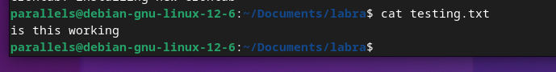

Jos tekisin tätä aiemmin tehdyllä palvelimella tekisin:

```
sudo apt-get update
```

```
sudo systemctl restart apache2
```

Aloitin asentamalla legon:

```
sudo apt-get install lego
```

Seuraavaksi etsein staging environmentissa käytettävän osoiteteen Let't Encrypt [sivuilta](https://letsencrypt.org/fi/docs/staging-environment/).

Staging Environment url:

```
https://acme-staging-v02.api.letsencrypt.org/directory
```

Seuraavaksi tein lego-nimisen kansion käyttäjän kotihakemistoon:

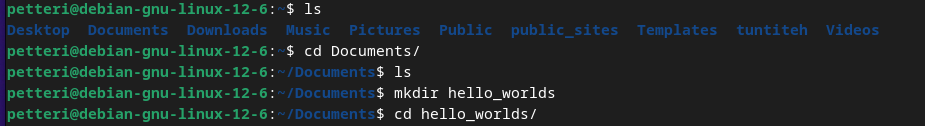

Seuraavaksi ajoin komennon tunnilla käydyn perusteella ja varmistallen komennon oikeellisuutta Lego:n [dokumentaatiosta](https://go-acme.github.io/lego/usage/cli/obtain-a-certificate/index.html#using-an-existing-running-web-server):

```
lego --server=https://acme-staging-v02.api.letsencrypt.org/directory --accept-tos --email=petteri.pinkkila@outlook.com --domains=pinkkhub.com --domains=www.pinkkhub.com --http --http.webroot='/home/admin/public_sites/pinkkhub.com' --path='/home/admin/lego' --pem run
```

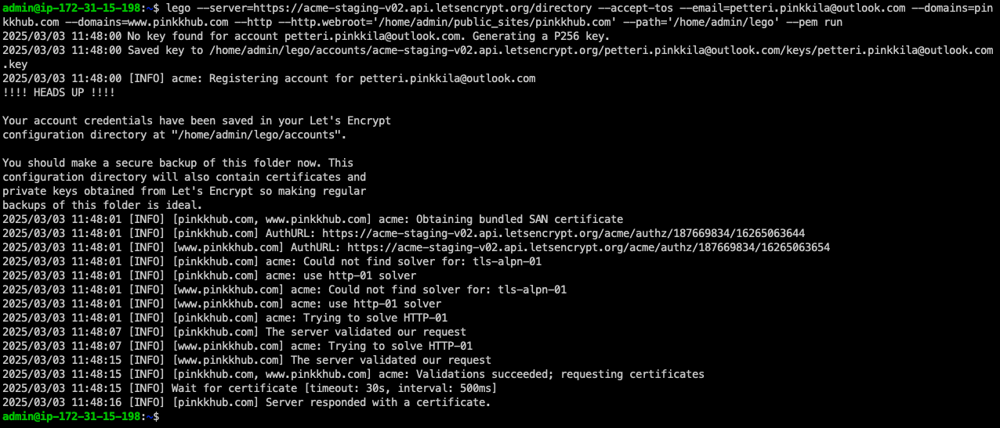

Tarkistin vielä kansiot:


Nimesin stageing-hakemiston uudelleen ja tein uuden lego hakemiston:

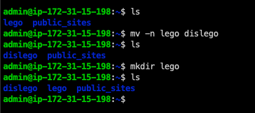

Seuravaksi poistin --server=... optionin lego-komennosta:

```
lego --accept-tos --email=petteri.pinkkila@outlook.com --domains=pinkkhub.com --domains=www.pinkkhub.com --http --http.webroot='/home/admin/public_sites/pinkkhub.com' --path='/home/admin/lego' --pem run
```

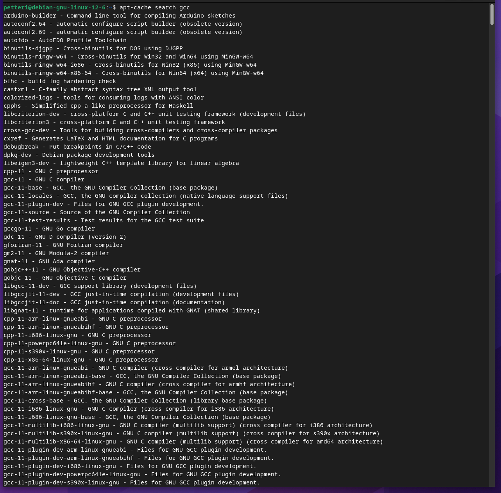

Tarkistin taas kansiot:

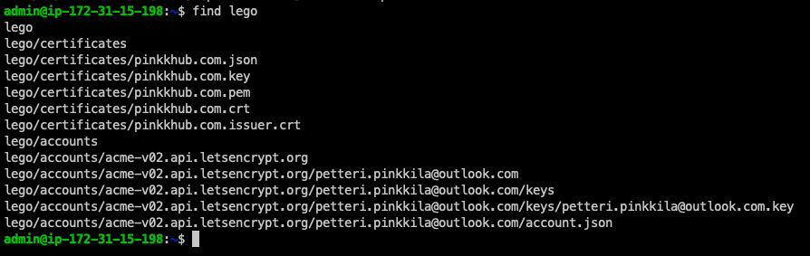

Seuraavaksi muokkasin tunnillakäydyn mukaisesti pinkkhub.com.conf tiedostoa:

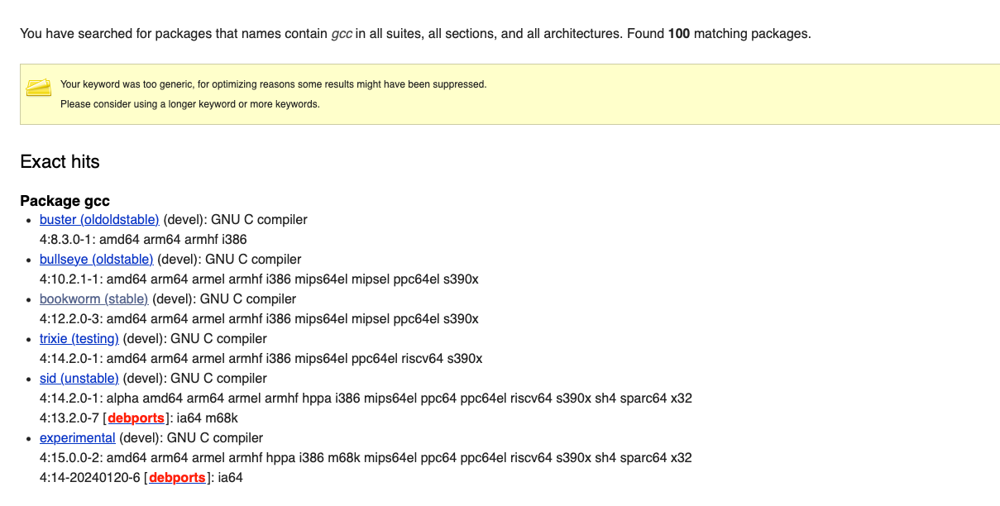

Seuraavaksi käynnistin apachen uudelleen ja sain seuraavan virhe-ilmoituksen:

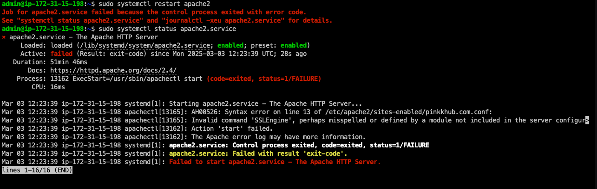

Tero Karvisen [sivujen ohjeilla](https://terokarvinen.com/linux-palvelimet/) ajoin seuraavat komennot:

```
sudo a2enmod ssl
```

```
sudo apache2ctl configtest
```

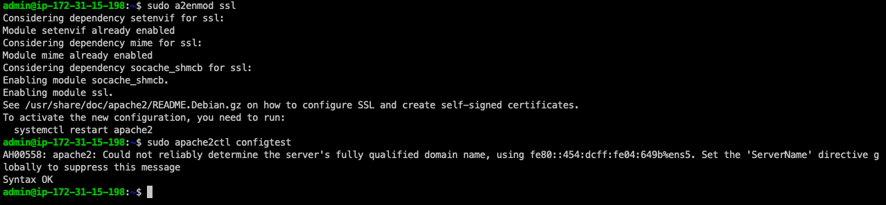

Ja tämän jälkeen käynnistin Apachen uudelleen. 

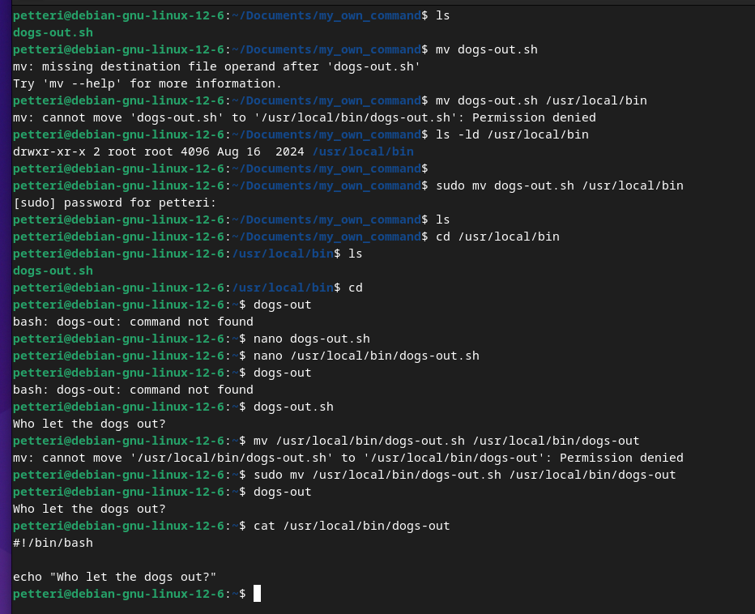


Koska käytän AWS:n EC2 palvelinta, määritin Security Groupiin uuden Inbound rulen, joka sallii https portista 443:

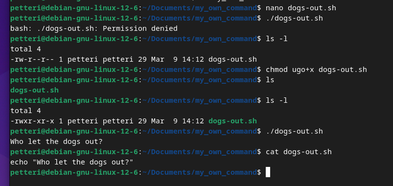

Avasin myös palomuuriin portin 443:

```
sudo ufw allow 443/tcp
```

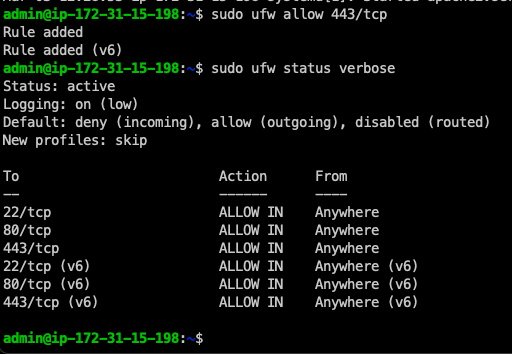

Seuraavaksi kokeillaan toimiiko https yhteys:

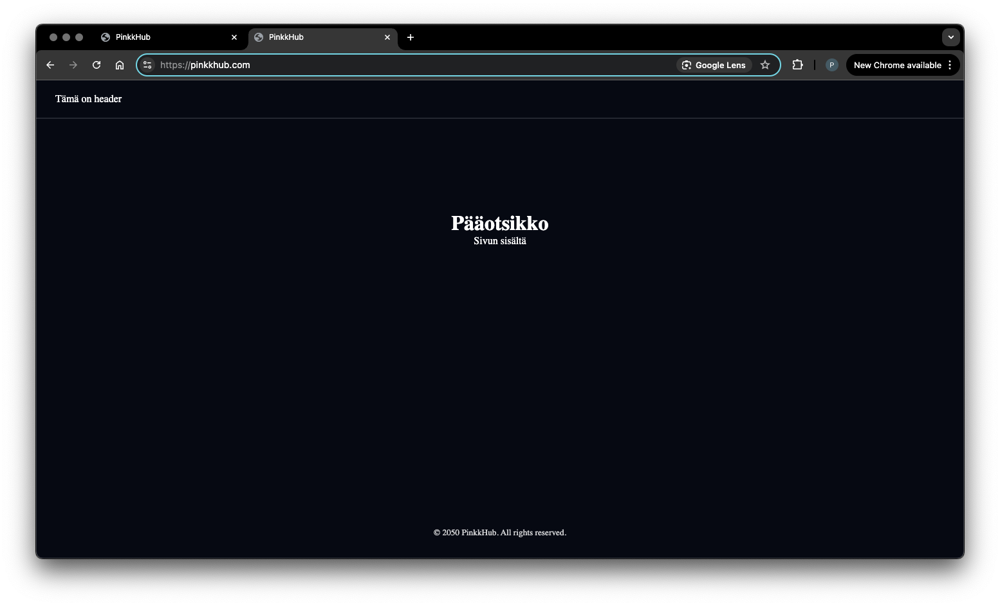


Konfigurointi näyttää onnistuneen.

---

### b) A-rating. Testaa oma sivusi TLS jollain yleisellä laadunvarmistustyökalulla, esim. [SSLLabs](https://www.ssllabs.com/ssltest/) (Käytä vain tavanomaisia tarkistustyökaluja, ei tunkeutumistestausta eikä siihen liittyviä työkaluja)

Sain A-luokituksen ja kaikki muut paitsi Key Exchange ja Cipher Strength  olivat täydet. 

Jos ymmärrän oikein [tästä](https://stackoverflow.com/questions/41930060/how-do-you-score-a-with-100-on-all-categories-on-ssl-labs-test-with-lets-encry) Stack Overflow kysymyksestä niin, jotta Key Exchanges saisi 100 tarvitsisi ilmeisesti käyttää 4096 bittistä avainta.   

Chipher on algoritmi, jolla tehdään kryptaus tai dekryptaus, lähde [wikipedia](https://en.wikipedia.org/wiki/Cipher). Chipher Strengtin parantamiseksi olettaisin, että pitäisi jotenkin varmaan lisätä tai vaihtaa paremmiksi myöhemmin listattavia (Configuration) kryptauksia tai dekryptauksia. MUTTA luettuani [tämän](https://webmasters.stackexchange.com/questions/114447/ssl-labs-cipher-strength-100-why-how-do-i-make-it) ja jos ymmärrän oikeni nuo "WEAK":lla merkityt ovat vanhoja algoritmeja ja paremman arvosanan kai saisi, jos konfiguroisi ne ilmeisesti kokonaan pois. Voin olla kyllä, että ymmärrän ihan väärin. 

Mietein mikä on DNS CAA, jota minulla siis ei ole, ja sen on Let's Encruptin [mukaan](https://letsencrypt.org/fi/docs/caa/): CAA on DNS record tyyppi, joka sallii sivun omistajan määrittää mikä Certificate Authorities (CAs) ovat sallittuja käsittelemään serfitikaatteja, jotka sisältävät tämän domain nimen.  


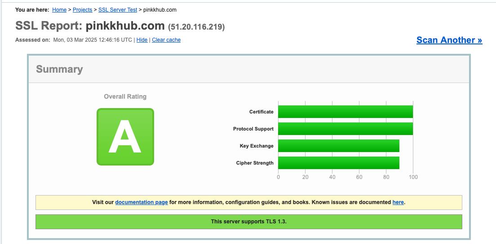

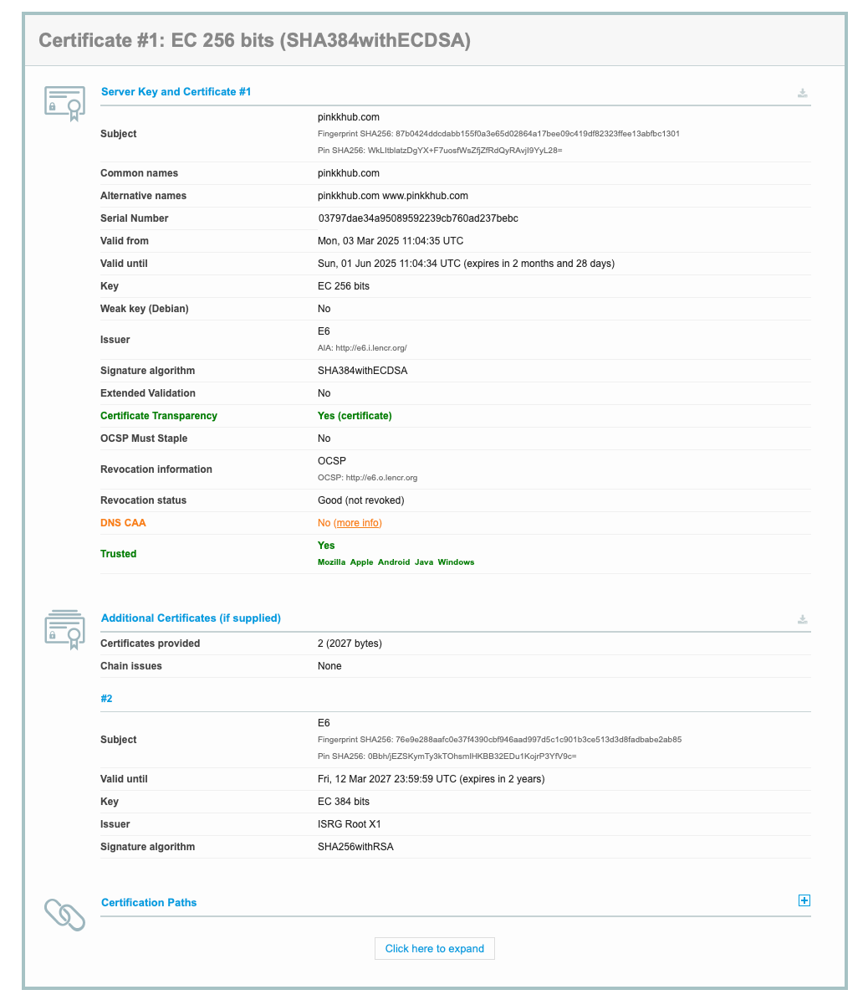


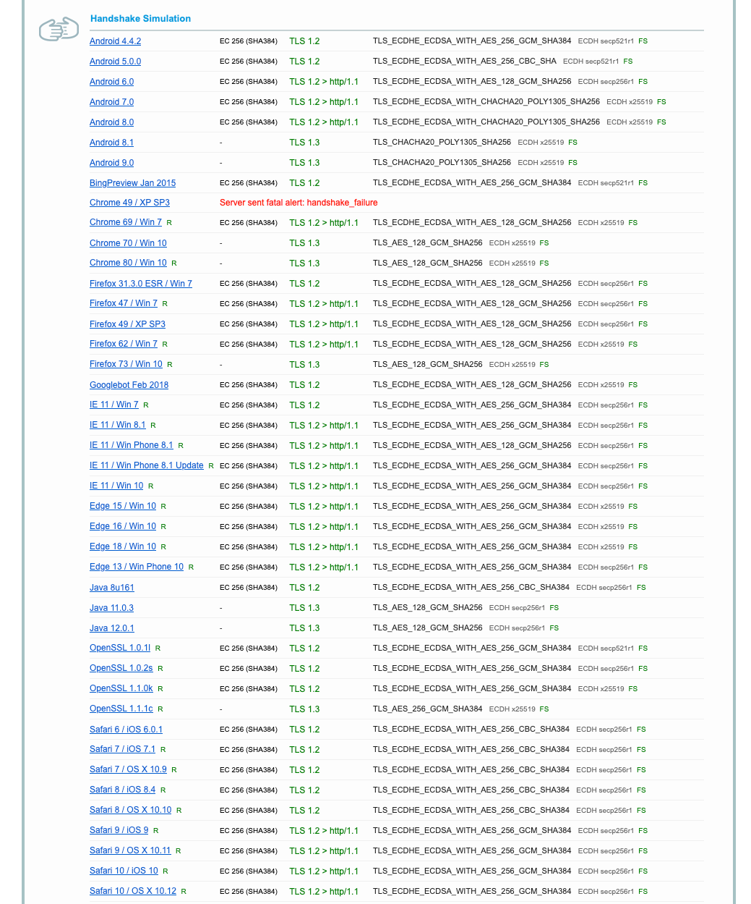


---

### c) Vapaaehtoinen: Tee weppilomake, jossa on käyttäjätunnus ja salasana. Käytä salaamatonta http-yhteyttä. Sieppaa liikennettä (esim. Wireshark, ngrep).

Päätin tehdä yksinkertaisesti virtuaalikoneella lokaalista ja ensin tein html:n:

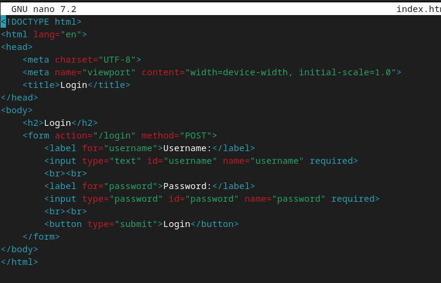


Seuraavaksi asensin ngrep

```
sudo apt-get install ngrep
```

Laitoin seuraavan komennon (Lähde: [sourceforge](https://ngrep.sourceforge.net/usage.html)) ja syötin lomakkeeseen user ja password:

```
sudo ngrep -d any port 80
```


Ei ole hirveän yllättävää, että salasana ja käyttänimi tulevat selkeästi esille, koska yhteyttä ei ole mitenkään salattu.

---

## Lähteet

Let's Encrypt. How it works: https://letsencrypt.org/how-it-works/.

Lego. Obtain a Sertificate: https://go-acme.github.io/lego/usage/cli/obtain-a-certificate/index.html#using-an-existing-running-web-server

Apache. Docs: https://httpd.apache.org/docs/2.4/ssl/ssl_howto.html#configexample

Internet Engineering Task Force (IETF). Automatic Certificate Management Environment (ACME): https://datatracker.ietf.org/doc/html/rfc8555

Wikipedia. Certificate authority: https://en.wikipedia.org/wiki/Certificate_authority


Wikipedia. TLS: https://fi.wikipedia.org/wiki/TLS

Let's Encrypt. Staging Environment: https://letsencrypt.org/fi/docs/staging-environment/

Tero Karvinen. Linux Palvelimet 2025 alkukevät: https://terokarvinen.com/linux-palvelimet/

SSLLabs. SSL Server Test: https://www.ssllabs.com/ssltest/

Wikipedia. Chipher: https://en.wikipedia.org/wiki/Cipher

Stack Overflow. How do you score A+ with 100 on all categories on SSL Labs test with Let's Encrypt and Nginx?:  https://stackoverflow.com/questions/41930060/how-do-you-score-a-with-100-on-all-categories-on-ssl-labs-test-with-lets-encry

WebMasters. SSL Labs Cipher Strength < 100%, why? How do I make it?:  https://webmasters.stackexchange.com/questions/114447/ssl-labs-cipher-strength-100-why-how-do-i-make-it

Let's Encrypt Certificate Authority Authorization (CAA): https://letsencrypt.org/fi/docs/caa/

SourceForge. ngrep: https://ngrep.sourceforge.net/usage.html