# Maalisuora

Tehtävät ovat Tero Karvisen opintojaksolta [Linux Palvelimet 2025 alkukevät](https://terokarvinen.com/linux-palvelimet/)

#### Laite jolla tehtävät tehdään:

- Apple MacBook Pro M2 Max
- macOS Sequoia 15.3.1
- Parallels ARM Virtual Machine
- Debian GNU/Linux 12.6

---


### a) Kirjoita ja aja "Hei maailma" kolmella kielellä.

#### Java

Päätin aloittaa Javalla ja halusin tarkistaa, mitä JKD vaihtoehtoja olisi. En muistanut millä komennolla etsiä mahdollisia paketteja joten googlailin ja löysin [debian-wikistä](https://wiki.debian.org/PackageManagement/Searching) seuraavan komennon:

```
apt-cache search packagename
```

Ja sain tulokseksi:

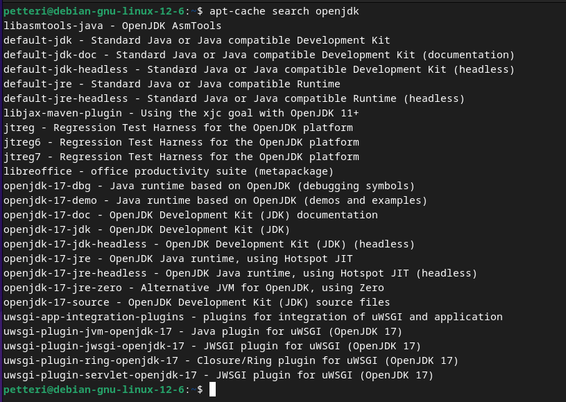


Ihmettelin hiukan, että eikö vaihtoehtoina ole mitään uudempaa kuin 17 ja ajattelin johtuuko se Debianin hitaasta päivitystahdista. Halusin nähdä mitä tapahtuu, jos laittaa uudemman version joten ajoin komennon versiolla 21, mutta pakettia ei (tietenkään) löytynyt. Katoin [Oraclen sivuilta](https://www.oracle.com/java/technologies/downloads/) ja sieltä tietysti voisi ladata uusimmat versiot JDK:sta mutta kätevyyden vuoksi asentaa package managerilla JKD 17.

```
sudo apt-get install openjdk-17-jdk
```

Seuraavaksi loin käyttäjän kotihakemiston Documents hakemistoon hello_worlds hakemiston:


Ja seuraavaksi tein Hello.java tiedoston:

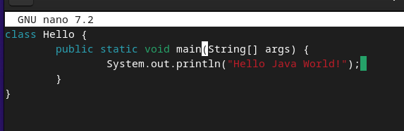

Seuraavaksi käänsin ohjelman ja ajoin sen: 

```
javac Hello.java
```

```
java Hello
```


#### Python

Pythonin suhteen itselläni on nolla osaaminen, joten tarkistin [tästä videosta](https://www.youtube.com/watch?v=3cVAHD4mi30), että miten tämä nyt menikään. 

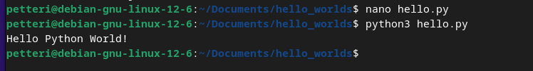

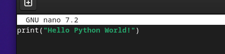


#### C

C:tä en ole kirjoittanut koskaan, mutta tiedän hiukan C:n historiasta ja sen merkityksestä ohjelmointiin ja ohjelmointikieliin, joten tämä on jännittävää.

Tutkein asiaa hieman ja Tero Karvisen [sivujen](https://terokarvinen.com/2018/hello-python3-bash-c-c-go-lua-ruby-java-programming-languages-on-ubuntu-18-04/) ja [tämän](https://www.youtube.com/watch?v=U3aXWizDbQ4) Fireship videon perusteella tein seuraavaa.

Ensin katsoin mitä seuraava komento antaa (gcc Karvisen sivuilta ja joka Fireshipin videon mukaan on olettavasti GNU C Compiler):

```
apt-cache search gcc
```

Vaihtoehtoja tuli vaikka kuinka paljon:


Googlailtuani ja [tämän mukaan](https://packages.debian.org/search?keywords=gcc) (kuva alla) oletteisin, että komento gcc ilman versioita asentaa paketin, jossa on itselleni sopiva kääntäjä


Seuraavaksi laitoin komennon 

```
sudo apt-get install gcc
```

Ja tämän jälkeen kävi ilmi, että minulla oli C-kääntäjä valmiiksi asennettuna:

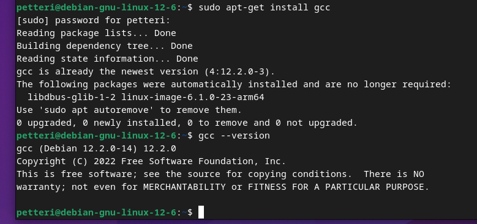

Seuraavaksi mukailin Fireshipin videota ja Karvisen sivua ja tein hello.c nimisen tiedoston, johon kirjoitin seuraavaa:


ja seuraavaksi käänsin ja ajoin. 

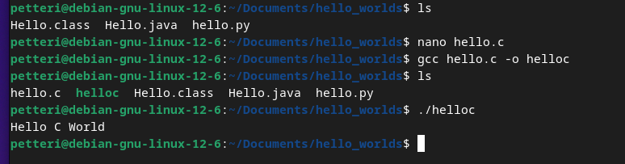


### c) Laita Linuxiin uusi, itse tekemäsi komento niin, että kaikki käyttäjät voivat ajaa sitä.

Aloitin tekemällä scriptin käyttäjän kotihakemistoon, niin kuin muistaakseni Tero neuvoi tekemään tunnilla. 


Seuraavaksi siirsin scriptin hakemistoon usr/local/bin ja muokkasin Teron [ohjeilla](https://terokarvinen.com/2007/12/04/shell-scripting-4/) scriptiä:


Komento toimii myös parallels-käyttäjällä.

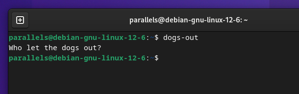

### d) Ratkaise vanha arvioitava laboratorioharjoitus soveltuvin osin.

Asensin tehtävää varten uuden virtuaalikoneen. Tein tämän samalla tavalla kuin tehtävässä [h1](https://github.com/pinkkila/linux-course/blob/main/tehtava-h1.md). Jätin alustavasti itselleni default käyttäjän parallels. 

Päätin tehdä soveltuvin osin tehtävät labrasta [Final Lab for Linux Palvelimet 2024 Spring](https://terokarvinen.com/2024/arvioitava-laboratorioharjoitus-2024-linux-palvelimet/):

#### labraharjoitus d) 'howdy'

- Tee kaikkien käyttäjien käyttöön komento 'howdy'
- Tulosta haluamaasi ajankohtaista tietoa, esim päivämäärä, koneen osoite tms
- Pelkkä "hei maailma" ei riitä
- Komennon tulee toimia kaikilla käyttäjillä työhakemistosta riippumatta 

Tein seuraavan scriptin:

```
#!/bin/bash

user=$(whoami)

today=$(date +"%Y-%m-%d")

echo "Hi, $user!"
echo "Today's date is: $today"

```

Päivämäärän suhteen otin hieman mallia Teron viime tunnin esimerkistä ja selvitin geeksforgeeks [oheilla](https://www.geeksforgeeks.org/bash-script-define-bash-variables-and-its-types/) miten muuttujiin laitettua komentoja. 

Scripti toimi:


Seuraavaksi siirsin scriptin /usr/local/bin hakemistoon ja muutin nimen pelkäksi howdy:ksi.

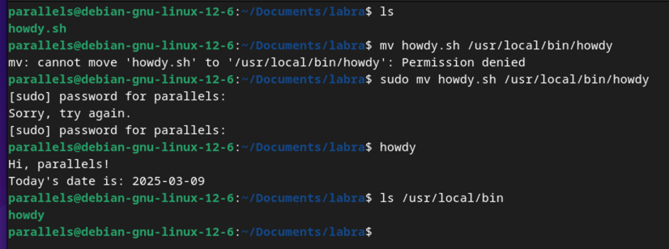


#### labraharjoitus e) Etusivu uusiksi

- Asenna Apache-weppipalvelin
- Tee yrityksellemme "AI Kakone" kotisivu
- Kotisivu tulee näkyä koneesi IP-osoitteella suoraan etusivulla
- Sivua pitää päästä muokkaamaan normaalin käyttäjän oikeuksin (ilman sudoa). Liitä raporttiisi listaus tarvittavien tiedostojen ja kansioiden oikeuksista.

Ajoin seuraavat komennot:

```
sudo apt-get install apache2
```

```
echo default-page | sudo tee /var/www/html/index.html
```

```
sudoedit /etc/apache2/sites-available/esim.example.com.conf
```

```
<VirtualHost *:80>
    ServerName esim.example.com
    ServerAlias www.esim.example.com
    DocumentRoot /home/parallels/public_sites/esim.example.com
    <Directory /home/parallels/public_sites/esim.example.com>
        Require all granted
    </Directory>
</VirtualHost>
```

```
sudo a2ensite esim.example.com
```

```
sudo a2dissite 000-default.conf
```

```
sudo systemctl restart apache2
```

```
mkdir -p /home/parallels/public_sites/esim.example.com/
```

```
echo test > /home/parallels/public_sites/esim.example.com/index.html
```

```
sudo chmod ugo+x /home/parallels
```

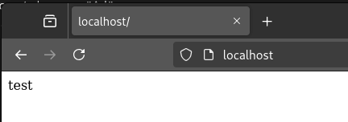

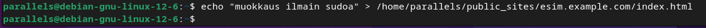

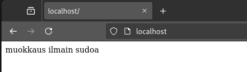

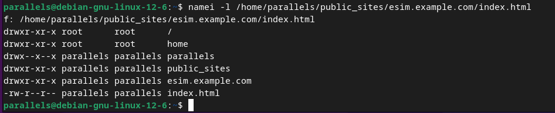


#### labraharjoitus g) Salattua hallintaa

- Asenna ssh-palvelin
- Tee uusi käyttäjä omalla nimelläsi, esim. minä tekisin "Tero Karvinen test", login name: "terote01"
- Automatisoi ssh-kirjautuminen julkisen avaimen menetelmällä, niin että et tarvitse salasanoja, kun kirjaudut sisään. Voit käyttää kirjautumiseen localhost-osoitetta

Tein vastaavan toteutuksen [tehtävässäni h5](https://github.com/pinkkila/linux-course/blob/main/tehtava-h4.md) AWS:n EC2:lla ja halusinkin nyt kokeilla niin, että tekisin omalle paikalliselle virtuaalikoneelleni toisen käyttäjän, jolle voisin kirjautua SSH:lla. Näin voisin kokeilla oikeuksia ja kaikkea muuta samalla tavalla kuin Tero on demoillut tunnilla.  

Käytin apuna Tero Karvisen [ohjeita](https://terokarvinen.com/linux-palvelimet/) Linux Palvelimet 2025 alkukevät sivulta kohdasta h4 Maailma kuulee vinkit ja omaa [tehtävääni lähteineen](https://github.com/pinkkila/linux-course/blob/main/tehtava-h4.md). 

Asensin OpenSSH-clietin Teron ohjeiden komennolla:
```
sudo apt-get -y install openssh-client
```

Lisäsin käyttäjän Teron oheiden komennolla:
```
sudo adduser petteri
```

Lisäsin sudo oikeudet Teron ohjeiden komennolla:
```
sudo adduser petteri sudo
```

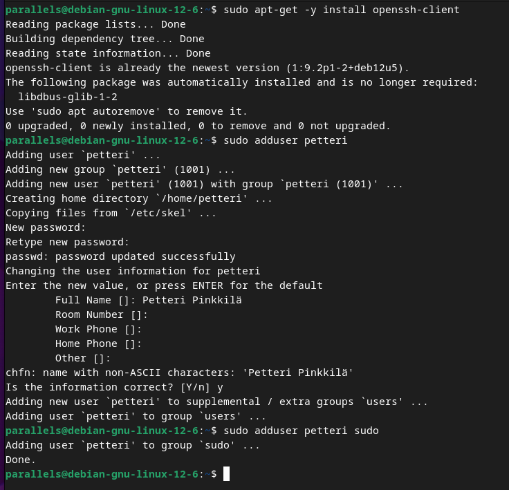


Tein SSH-avain parin Teron ohjeiden komennolla

```
ssh-keygen
```

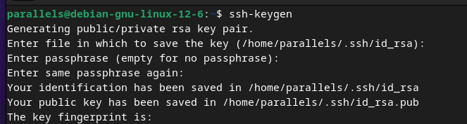

Vaihtoin käyttäjää ja tein ./ssh hakemiston johon tiedoston athuhorized-keys ja muutin niiden oikeuksia omien ohjeideni mukaan, jotka ovat AWS:n [tutoriaali-videosta](https://www.youtube.com/watch?v=gpurd3Av5S8)):

```
sudo -su petteri
```

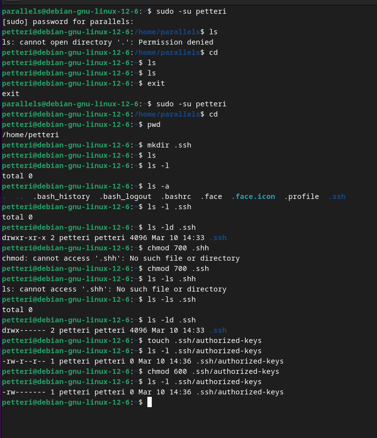

authorized-keys oli väärin kirjoitettu ja minun olisi pitänyt kirjoittaa authorized_keys.

Kirjautuminen ei toiminut ja sekoilin hieman kunnes syötin seuraavan komennon, joka oletettavasti kirjoitti myös uuden oikein kirjoitetun authorized_keys nimisen  tiedoston:

```
cat >> .ssh/authorized_keys
```


Tuo komento jää auki, niin että siihen pystyy copy pastella syöttämään alla olevan kuvan kansiosta oikean avaimen (eli public keyn, private key on käyttäjällä parallels).

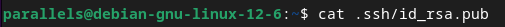


Poistin väärän tiedoston ja korjasin oikeudet:

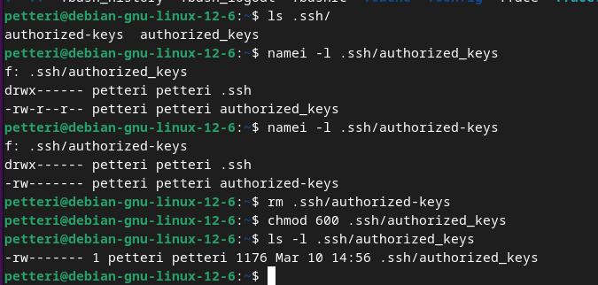

Testasin vielä, että kirjautuminen toimii:

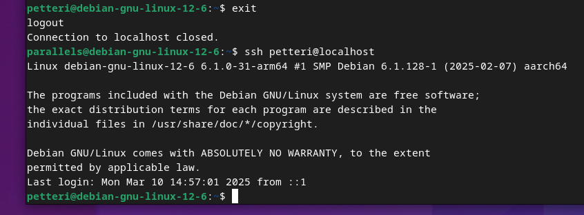

Eli tässä yhteenveto komennoista:

```
sudo apt-get -y install openssh-client
```

```
sudo adduser petteri
```

```
sudo adduser petteri sudo
```

```
ssh-keygen
```

```
sudo -su petteri
```

```
mkdir .ssh
```

```
chmod 700 .shh
```

```
touch .ssh/authorized_keys
```

```
chmod 600 .ssh/authorized_keys 
```

exit ja alkuperäisellä käyttäjällä seuraava ja kopioi:

```
cat .ssh/id_rsa.pub
```

Toisella käyttäjällä taas sisään sudo -su ja sitten seuraava (jää auki pasteta ja ctr + c)

```
cat >> .ssh/authorized_keys
```

```
ssh petteri@localhost
```


---

## Lähteet

Tero Karvinen. Linux Palvelimet 2025 alkukevät: https://terokarvinen.com/linux-palvelimet/

Debian Wiki. PackageManagementSearching: https://wiki.debian.org/PackageManagement/Searching

Oracle. Java Downloads: https://www.oracle.com/java/technologies/downloads/

YouTube: Cobb Coding. How to Write Hello World in Python: https://www.youtube.com/watch?v=3cVAHD4mi30

Tero Karvinen. Hello World Python3, Bash, C, C++, Go, Lua, Ruby, Java – Programming Languages on Ubuntu 18.04: https://terokarvinen.com/2018/hello-python3-bash-c-c-go-lua-ruby-java-programming-languages-on-ubuntu-18-04/

YouTube: Fireship. C in 100 Seconds: https://www.youtube.com/watch?v=U3aXWizDbQ4

Debian packages: https://packages.debian.org/search?keywords=gcc

Tero Karvinen. Shell Scripting: https://terokarvinen.com/2007/12/04/shell-scripting-4/

Tero Karvinen.Final Lab for Linux Palvelimet 2024 Spring: https://terokarvinen.com/2024/arvioitava-laboratorioharjoitus-2024-linux-palvelimet/
 
Tero Karvinen. Final Lab for Linux Palvelimet 2024 Autumn: https://terokarvinen.com/2024/arvioitava-laboratorioharjoitus-2024-syksy-linux-palvelimet/

GeeksForGeeks. Bash Script – Define Bash Variables and its types: https://www.geeksforgeeks.org/bash-script-define-bash-variables-and-its-types/

Amazon Web Services: How do I add new user accounts with SSH access to my Amazon EC2 Linux instance?: https://www.youtube.com/watch?v=gpurd3Av5S8
