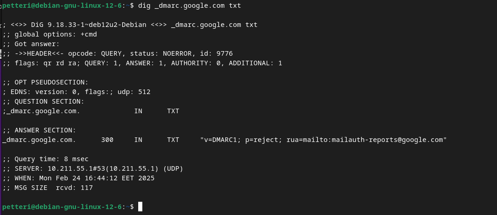

# Maalisuora

Tehtävät ovat Tero Karvisen opintojaksolta [Linux Palvelimet 2025 alkukevät](https://terokarvinen.com/linux-palvelimet/)

#### Laite jolla tehtävät tehdään:

- Apple MacBook Pro M2 Max
- macOS Sequoia 15.3.1
- Parallels ARM Virtual Machine
- Debian GNU/Linux 12.6

---


### a) Kirjoita ja aja "Hei maailma" kolmella kielellä.

#### Java

Päätin aloittaa Javalla ja halusin tarkistaa, mitä JKD vaihtoehtoja olisi. En muistanut millä komennolla etsiä mahdollisia paketteja joten googlailin ja löysin [debian-wikistä](https://wiki.debian.org/PackageManagement/Searching) seuraavan komennon:

```
apt-cache search packagename
```

Ja sain tulokseksi:




Ihmettelin hiukan, että eikö vaihtoehtoina ole mitään uudempaa kuin 17 ja ajattelin johtuuko se Debianin hitaasta päivitystahdista. Halusin nähdä mitä tapahtuu, jos laittaa uudemman version joten ajoin komennon versiolla 21, mutta pakettia ei (tietenkään) löytynyt. Katoin [Oraclen sivuilta](https://www.oracle.com/java/technologies/downloads/) ja sieltä tietysti voisi ladata uusimmat versiot JDK:sta mutta kätevyyden vuoksi asentaa package managerilla JKD 17.

```
sudo apt-get install openjdk-17-jdk
```

Seuraavaksi loin käyttäjän kotihakemiston Documents hakemistoon hello_worlds hakemiston:


Ja seuraavaksi tein Hello.java tiedoston:


Seuraavaksi käänsin ohjelman ja ajoin sen: 

```
javac Hello.java
```

```
java Hello
```


#### Python

Pythonin suhteen itselläni on nolla osaaminen, joten tarkistin [tästä videosta](https://www.youtube.com/watch?v=3cVAHD4mi30), että miten tämä nyt menikään. 


#### C

C:tä en ole kirjoittanut koskaan, mutta tiedän hiukan C:n historiasta ja sen merkityksestä ohjelmointiin ja ohjelmointikieliin, joten tämä on jännittävää.

Tutkein asiaa hieman ja Tero Karvisen [sivujen](https://terokarvinen.com/2018/hello-python3-bash-c-c-go-lua-ruby-java-programming-languages-on-ubuntu-18-04/) ja [tämän](https://www.youtube.com/watch?v=U3aXWizDbQ4) Fireship videon perusteella tein seuraavaa.

Ensin katsoin mitä seuraava komento antaa (gcc Karvisen sivuilta ja joka Fireshipin videon mukaan on olettavasti GNU C Compiler):

```
apt-cache search gcc
```

Vaihtoehtoja tuli vaikka kuinka paljon:


Googlailtuani ja [tämän mukaan](https://packages.debian.org/search?keywords=gcc) (kuva alla) oletteisin, että komento gcc ilman versioita asentaa paketin, jossa on itselleni sopiva kääntäjä


Seuraavaksi laitoin komennon 

```
sudo apt-get install gcc
```

Ja tämän jälkeen kävi ilmi, että minulla oli C-kääntäjä valmiiksi asennettuna:


Seuraavaksi mukailin Fireshipin videota ja Karvisen sivua ja tein hello.c nimisen tiedoston, johon kirjoitin seuraavaa:


ja seuraavaksi käänsin ja ajoin. 


### c) Laita Linuxiin uusi, itse tekemäsi komento niin, että kaikki käyttäjät voivat ajaa sitä.

Aloitin tekemällä scriptin käyttäjän kotihakemistoon, niin kuin muistaakseni Tero neuvoi tekemään tunnilla. 


Seuraavaksi siirsin scriptin hakemistoon usr/local/bin ja muokkasin Teron [ohjeilla](https://terokarvinen.com/2007/12/04/shell-scripting-4/) scriptiä:


Komento toimii myös parallels-käyttäjällä.


### d) Ratkaise vanha arvioitava laboratorioharjoitus soveltuvin osin.


---

## Lähteet

Tero Karvinen. Linux Palvelimet 2025 alkukevät: https://terokarvinen.com/linux-palvelimet/

Debian Wiki. PackageManagementSearching: https://wiki.debian.org/PackageManagement/Searching

Oracle. Java Downloads: https://www.oracle.com/java/technologies/downloads/

YouTube: Cobb Coding. How to Write Hello World in Python: https://www.youtube.com/watch?v=3cVAHD4mi30

Tero Karvinen. Hello World Python3, Bash, C, C++, Go, Lua, Ruby, Java – Programming Languages on Ubuntu 18.04: https://terokarvinen.com/2018/hello-python3-bash-c-c-go-lua-ruby-java-programming-languages-on-ubuntu-18-04/

YouTube: Fireship. C in 100 Seconds: https://www.youtube.com/watch?v=U3aXWizDbQ4

Debian packages: https://packages.debian.org/search?keywords=gcc

Tero Karvinen. Shell Scripting: https://terokarvinen.com/2007/12/04/shell-scripting-4/