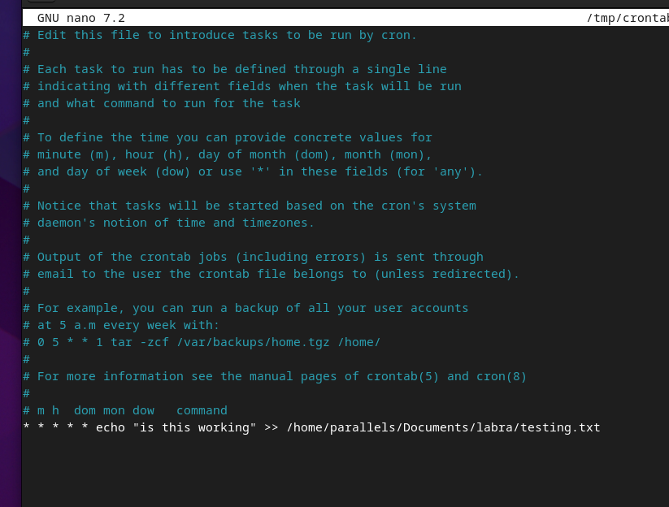

# h8 Bonus

Tehtävät ovat Tero Karvisen opintojaksolta [Linux Palvelimet 2025 alkukevät](https://terokarvinen.com/linux-palvelimet/)

#### Laite jolla tehtävät tehdään:

- Apple MacBook Pro M2 Max
- macOS Sequoia 15.3.1
- Parallels ARM Virtual Machine
- Debian GNU/Linux 12.6

---

## Vapaaehtoinen: Bonus: luettele ja linkitä tähän tekemäsi

### a) Vapaaehtoiset tehtävät

Olen tehnyt kaikki vapaaehtoiset tehtävät lukuunottamatta micron plugarin asentamista ja certin uusimista, joten teen niitä vastaavat tehtävät tässä. Kaikki muut vapaaehtoiset tehtävät löytyvät minun kurssille tekemästä [github-reposta](https://github.com/pinkkila/linux-course).

---

#### Micron plugarin asentaminen:

Kun ensimmäisellä kerralla tämä oli tehtävänä, minulla oli pikanäppäinkomennot asennettu niin, että control oli usealla kirjaimella käytössä, joten koin micon käyttämisen silloin hiukan hankala törmäävien komentojen vuoksi, mutta nyt olen vaihtanut controllin vain ihan muutamaan pikakomentoon, niin voisin kyllä alkaa käyttää microa nanon sijaan. Tehtävä on tehty Linux Palvelimet 2025 alkukevät sivun ohjeiden avulla. 

Ensin asensin micron. 

```
sudo apt-get -y install micro fzf exuberant-ctags
```

Seuraavaksi asensin jump:n [micro-jumpin GitHub-sivujen oheiden](https://github.com/terokarvinen/micro-jump) mukaan:

```
sudo apt-get -y install micro fzf exuberant-ctags
```

```
micro --plugin install jump
```

ja kokeilin


---

#### crontab

Ajattelin, että en tee TSL-sertifikaatin uusimista, mutta kokeilen muuten miten crontab toimii. 

Tero käytti tunnilla komentoa crontab -e, joten laitoin itse myös sen:

```
crontab -e
```

contab kysyi mitä editoria haluaisin käyttää ja valitsin itselleni tutumman nanon tässä kohtaa editoriksi.

Sitten laiton näin:



Ja se toimi:


### b) Ristiinarvioinnin jälkeen olennaisesti parannetut tehtävät


---

## Lähteet

Tero Karvinen. Linux Palvelimet 2025 alkukevät: https://terokarvinen.com/linux-palvelimet/

terokarvinen. micro-jump: https://github.com/terokarvinen/micro-jump